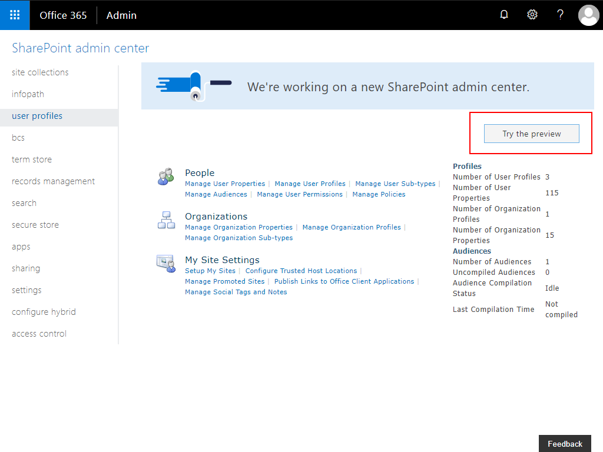

# Tenant API Management

The SPFx solution included with SP Starter Kit requires access to third party API's. Third party access is controlled via the `Service Principal Permissions Management Page` included as a part of the SharePoint Admin Center Preview.

## Approving pending API requests

When adding the included SPFx [`sharepoint-starter-kit.sppkg`](../package/sharepoint-starter-kit.sppkg) from the [`/package`](../package) folder manually to the tenant app catalog, manually approve the requested permissions.

Navigate to your tenant SharePoint Admin Center

Click on Preview to switch to the SharePoint Admin Center Preview

Navigate to **API Management**, your Service Principal Permissions Management Page

**Approve** the `Microsoft Graph` permission requests by selecting each permission request and clicking `Approve`

The pending permissions should now be approved.

**Note** currently the sample LOB service sample is in development and will utilize the SPFx-LOB-*** API permission requests. These requests can be ignored at this time. 

**Note** if you receive an error when approving a Microsoft Graph permission request, try to approve it again. In batch approvals, some requests may fail the first time.
