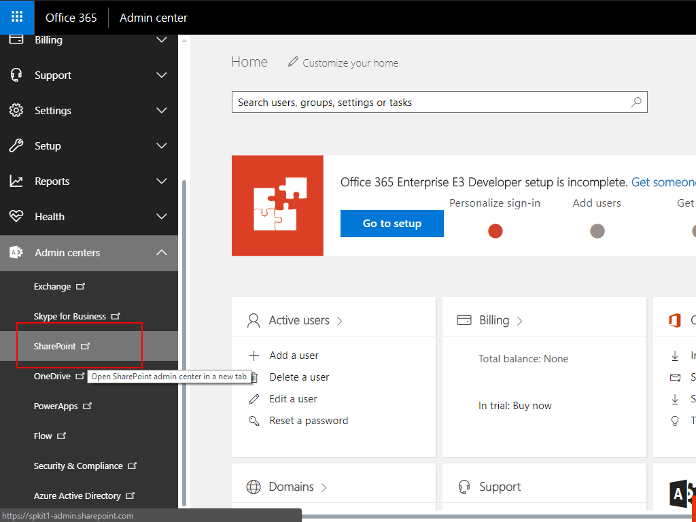
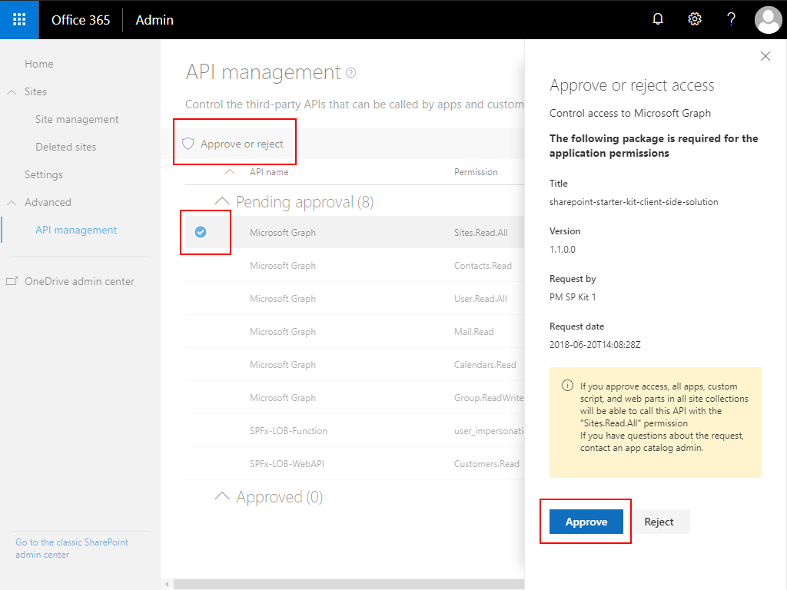
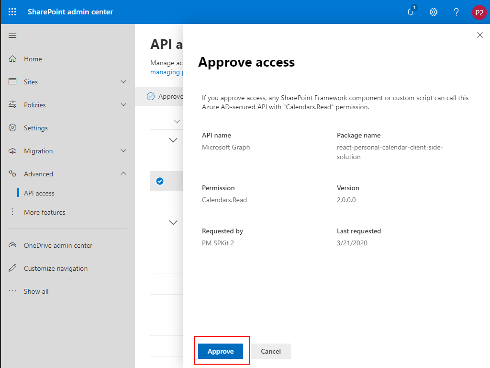
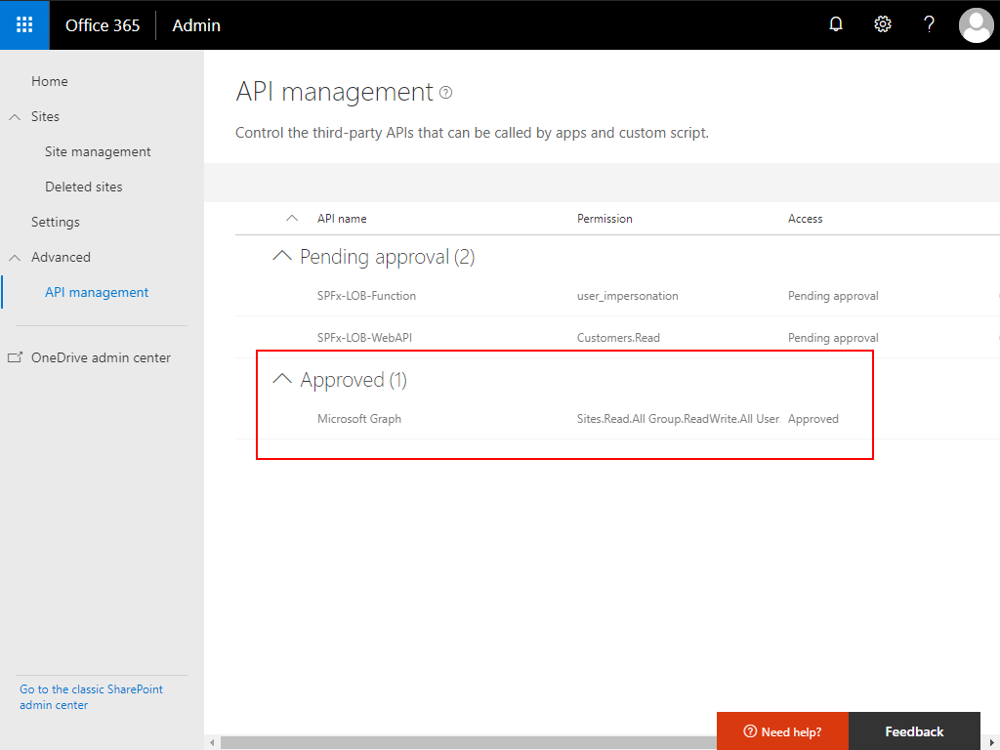

# Tenant API Management

The SPFx solution included with SP Starter Kit requires access to third party API's. Third party access is controlled via the `API access` page included as a part of the SharePoint admin center.


## Approving pending API requests

After installing the starter kit, or after adding the included SPFx [solution packages](../source) from the [`/source/'component'/sharepoint/solution`](../source) folders manually to the tenant app catalog, manually approve the requested permissions.

Two methods to approve API requests include:

- [Using the SharePoint admin center API access page](#Approve-pending-API-access-with-the-SharePoint-admin-center-API-access-page)

- [Using PnP PowerShell](#Approve-pending-API-access-with-PnP-PowerShell)


## Approve pending API access with the SharePoint admin center API access page

Navigate to your tenant SharePoint Admin Center




Navigate to **API access** found in the **advanced** menu, your API access Management Page. The API access menu item will only appear after you have provisioning the starter kit, or if there is at least one pending or approved API access request.


**Approve** the `Microsoft Graph` permission requests by selecting each permission request and clicking `Approve`






The pending permissions should now be approved.




**Note** currently the sample LOB service sample is in development and will utilize the SPFx-LOB-*** API permission requests. These requests can be ignored at this time. 

**Note** if you receive an error when approving a Microsoft Graph permission request, try to approve it again. In batch approvals, some requests may fail the first time.


## Approve pending API access with PnP PowerShell

**Advanced approval process - be sure you validate each API access request before approving**

Approving pending API access requests may also be accomplished with PnP PowerShell using the commandlet:

```powershell
Approve-PnPTenantServicePrincipalPermissionRequest
```

1. Open PowerShell and ensure you have installed the latest version of PnP PowerShell (validated at version 3.19.2003.0 or higher)

2. Connect to your tenant **using authorization credentials that have tenant administrative rigths**. This level of access is required to approve the API access requests

   ```powershell
   Connect-PnPOnline -Url https://[yourtenant].sharepoint.com
   ```

3. Execute the following PowerShell commandlets.

   *Note: This script will search for and approve any API access request made by any SPFx package added to your tenant app catalog that has a package name that begins with 'react-personal-', 'react-recent', or 'react-command-'. Be sure to review each API access request.

   ```powershell
   $requests = Get-PnPTenantServicePrincipalPermissionRequests
   $requestsToApprove = $requests | ? { $_.PackageName -like 'react-personal-*' -or $_.PackageName -like 'react-recent*' -or $_.PackageName -like 'react-commmand-*' }

   if ($requestsToApprove -ne $null)
   {
      foreach($request in $requestsToApprove)
      {
         Approve-PnPTenantServicePrincipalPermissionRequest -RequestId $request.Id
      }
   }
   ```
4. All API access requests for the starter kit should now be approved.
