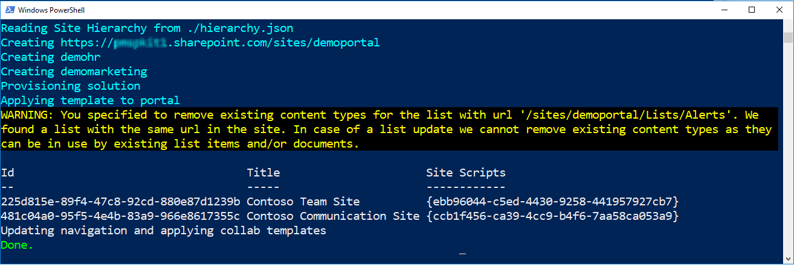
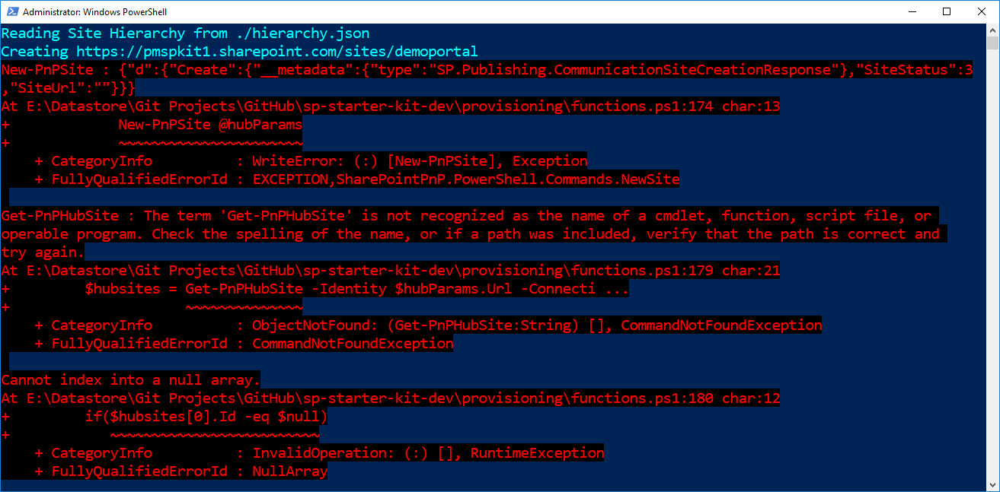
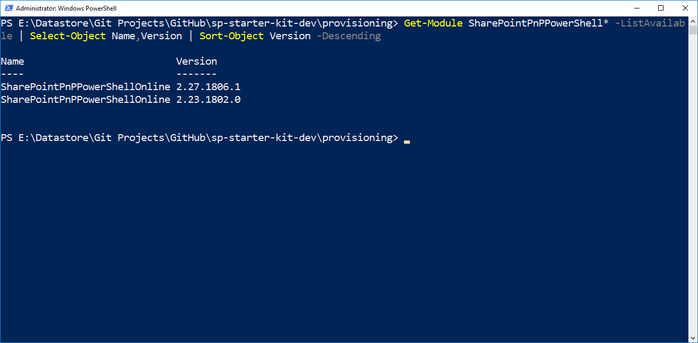
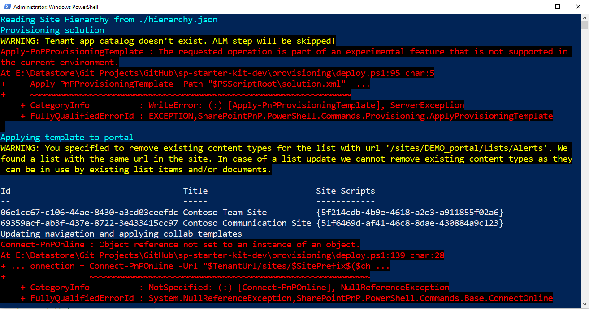
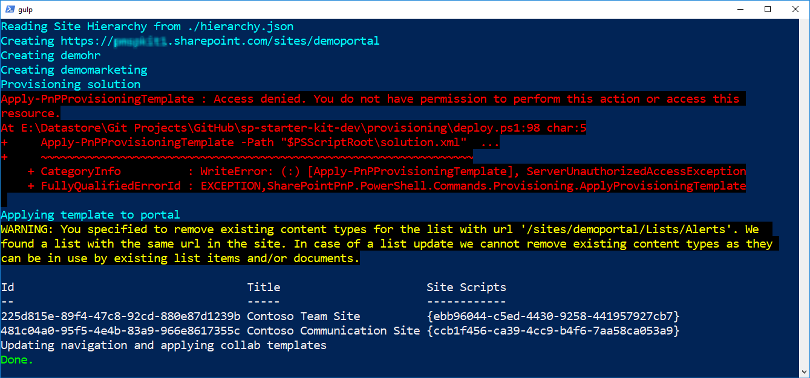
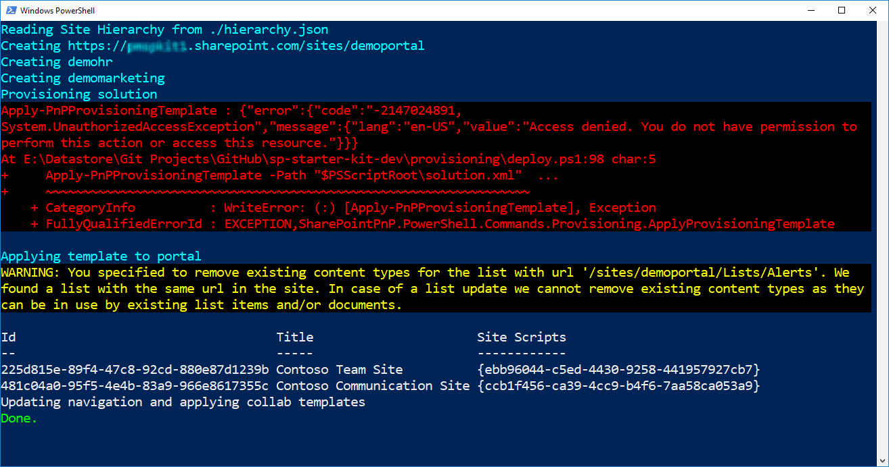
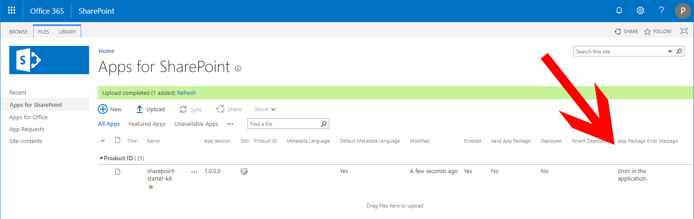

# Common SP Starter Kit Provisioning results

When provisioning SP Starter Kit following the [`deployment process`](../provisioning/readme.md), common outputs including the following.

All examples are based on running the following commands in PowerShell, where `[yourtenant]` is replaced with your specific tenant id.

```powershell
Connect-PnPOnline https://[yourtenant].sharepoint.com
Invoke-PnPTenantTemplate -Path starterkit.pnp
```

# Table of contents

- [Successful provisioning](#successful-provisioning)
- [ERROR: General cascading errors](#error-general-cascading-errors)
- [ERROR: Improper version of PnP PowerShell installed](#error-improper-version-of-pnp-powershell-installed)
- [ERROR: App Catalog Required](#error-app-catalog-required)
- [ERROR: Term Set Permissions Required](#error-term-set-permissions-required)
- [ERROR: Not Targeted Release](#error-not-targeted-release)
- [ERROR: Culture is not supported and/or (0x0c00) is an invalid culture identifier.](#error-culture-is-not-supported)
- [Invalid App package installation - API Management missing](#invalid-app-package-installation---api-management-missing)
- [ERROR: The user or administrator has not consented to use the application](#error-the-user-or-administrator-has-not-consented-to-use-the-application)
- [ERROR: Invoke-PnPTenantTemplate : The remote server returned an error: (401) Unauthorized](#error-invoke-pnptenanttemplate-:-the-remote-server-returned-an-error:-401-unauthorized)


## Successful provisioning

If all [`pre-requirements`](../#pre-requirements) have been addressed and met, no errors should be generated.




## ERROR: General cascading errors

`Watch the pre-requirements` If you see many cascading errors, most likely a pre-requirement has not been set.

1. Ensure you are connecting to your tenant site using a tenant admin account.

1. Ensure that you have the latest PnP PowerShell commandlets. You might need to remove the PnP PowerShell commandlets and re-install to ensure you have the latest. [`PnP PowerShell - Recommended 1.12.0 or later`](https://github.com/pnp/powershell/releases).

1. Verify you have already created your `tenant app catalog`.

1. Verify that the account you are using has Admin rights to the Site Collection for tenant app catalog (eg. /sites/appcatalog)

1. Verify the account you are using to connect to your tenant site has already been added as a **term store administrator**.

1. If you believe the error is new and not addressed below or in the [`issues list`](https://github.com/pnp/sp-starter-kit/issues), please submit a [`new issue`](https://github.com/pnp/sp-starter-kit/issues). If the error appears to be an **error reported in PowerShell**, please enable the **PnP Trace Log** before running the deploy.ps1 script and **report those findings** in your new issue.

   ```powershell
   Set-PnPTraceLog -On -Level Debug
   ```


## ERROR: Improper version of PnP PowerShell installed

[`PnP PowerShell - Recommended 1.12.0 or later`](https://github.com/pnp/powershell) is required for SP Starter Kit to properly provision. It is recommended that you have only the latest version of PnP PowerShell installed on your workstation as well.

If you do not have the proper version of PnP PowerShell installed, you may receive errors similar to:

`Invoke-PnPTenantTemplate : The term 'Invoke-PnPTenantTemplate' is not recognized as the name of a cmdlet, function, script file, or
operable program. Check the spelling of the name, or if a path was included, verify that the path is correct and try
again.`




### Recommended solution

Verify you have the latest PnP PowerShell commandlets installed, as well as look for competeting, older versions. If you receive any error that references that a given `term` is not `recognized as the name of a cmdlet, function, script file, or
operable program`, you have an issue with how PnP PowerShell is installed on your workstation.

```powershell
Get-Module PnP.PowerShell* -ListAvailable | Select-Object Name,Version | Sort-Object Version -Descending
```



`Update PnP PowerShell'

```powershell
Update-Module PnP.PowerShell*
```

`Remove older verions(s) of PnP PowerShell'

Based on the example above, we can see there are two versions of PnP PowerShell installed. We could remove version 1.6.0 with the following command:

```powershell
Get-InstalledModule -Name "PnP.PowerShell" -RequiredVersion 1.6.0 | Uninstall-Module
```

Alternatively you can decide to uninstall all installed version of PnP PowerShell and reinstall the latest module
```powershell
Uninstall-Module -Name "PnP.PowerShell" -AllVersions
Install-Module -Name "PnP.PowerShell"
```

> Notice - versions of the legacy PnP PowerShell released in 2020 may throw errors related to [permissions](#error-the-user-or-administrator-has-not-consented-to-use-the-application).

Recommended versions of PnP PowerShell include:
- 1.12.0 - Note: you may have to [grant consent](#error-the-user-or-administrator-has-not-consented-to-use-the-application)


## ERROR: App Catalog Required

The SP Starter Kit includes multiple SPFx solution packages, `*.sppkg`. By default these packages will be deployed to the tenant app catalog by the `Invoke-PnPTenantTemplate` cmdlet in to your tenant App Catalog.

If you have not completed this task, you might receive an error that includes:

```
WARNING: Tenant app catalog doesn't exist. ALM step will be skipped!
Invoke-PnPTenantTemplate : There is no app catalog site for this tenant.
```




### Recommended solution

[`Create a tenant app catalog`](./manual-deploy-sppkg-solution.md) and wait for deployment to complete, which may take minutes, hours, or possibly a day.

`Note`: If you recently created a new tenant or an [Microsoft 365 developer tenant](https://learn.microsoft.com/en-us/office/developer-program/microsoft-365-developer-program), you may receive an error similar to:

```
Sorry, something went wrong
Updates are currently disallowed on GET requests.  To allow updates on a GET, set the 'AllowUnsafeUpdates' property on SPWeb.
```

You may need to wait a few hours, possibly up to 24+ hours, after a new SharePoint tenant is created before creating a tenant app catalog as it takes a while for your SharePoint tenant to fully deploy.


## ERROR: Term Set Permissions Required

The deployment script includes a PnP provisioning template that attempts to configure demo terms within the managed metadata service / term store. For this to succeed, the account used to connect to your tenant must have been manually added as a term store administator. If you have not completed this task, you might receive an error that includes:

`Apply-PnPProvisioningHierarchy : Access denied. You do not have permissions to perform this action or access this resource.`




### Recommended solution

Verify that the account you are using to provision SP Starter Kit is a term store administrator.


## ERROR: Not Targeted Release

SP Starter Kit V2- required that your tenant be set to `Targeted Release` for all users. When the deployment script attempts to provision solution.xml to your tenant, included is an action to upload the included .sppkg SPFx solution to your tenant app catalog as well as approve API permissions. This step could fail if you have a legacy tenant that has not properly configured your tenant to `Targeted Release`.

If you encounter an error similar to the following, you might need to set your tenant to targetted release for all users:

`Apply-PnPProvisioningHierarchy : {"error":{"code":"-2147024891, System.UnauthorizedAccessException","message":"{"lang","en-us","value":"Access denied. You do not have permissions to perform this action or access this resource."}}}`



`This error can also appear if the login account is not an owner of the 'App Catalog' for the tenant

### Recommended solution

Ensure that your tenant is set to targeted release for all users.

`NOTE:` You will need to wait at least 24 hours after setting your tenant to targeted release before all required updates are provisioned to your tenant before the deploy script will execute correctly.


## ERROR: Culture is not supported

The SP Starter Kit end to end provisioning only works with tenants that are configured with the dafault language set to English, i.e. those with culture code 1033 enabled. It is possible that certain tenants have English available, while the default language is not set to 1033. This can cause issues when the provisioning process adds terms to to the term store.

You may receive an error in PowerShell similar to the following:

```powershell
Culture is not supported
```

```powershell
(0x0c00) is an invalid culture identifier.
```

### Recommended solution

Check to see that the current culture for your instance of PowerShell is ready for the template. Run "Get-Culture" in PowerShell

```powershell
Get-Culture
```

The expected output should be

```powershell
LCID             Name             DisplayName
----             ----             -----------
1033             en-US            English (Unitied States)
```

You can temporarily change to en-US for the provisioning process to continue.

```powershell
Set-Culture -CultureInfo en-US
```

Try to provision the Starter Kit again.

## Invalid App package installation - API Management missing

Deployment of the included SPFx solutions `.\source\[component]\sharepoint\solution\[component].sppkg` may be  [`completed manually`](./manual-deploy-sppkg-solution.md). In legacy tenants, if you do not have `Targeted Release` enabled for all users, or if you have enabled Targeted Release for all users but have not waited at least 24 hours to full roll out, you may encounter errors when manually deploying the .sppgk packages, or attempting to find API Management.

`Manually deploying .sppkg packages`

Although you will be able to upload the SPFx package to the tenant app catalog, an error will be thrown.



`API Management missing`

Without Targeted Release enabled, you will be unable to find `API Management` in the Preview Admin Center.


### Recommended solution

Ensure that your tenant is set to targeted release for all users.

`NOTE:` You will need to wait at least 24 hours after setting your tenant to targeted release before all required updates are provisioned to your tenant before the deploy script will execute correctly.


## ERROR: The user or administrator has not consented to use the application

Certain versions of PnP PowerShell released in 2020 contained PnP Core authentication methods that utilze a AAD application. If you receive an error similar to:

```powershell
The user or administrator has not consented to use the application with ID '31359c7f-bd7e-475c-86db-fdb8c937548e' named 'PnP Management Shell'. Send an interactive authorization request for this user and resource.
```

You should consider the following solution based on recommendations provided in issue 436: https://github.com/pnp/sp-starter-kit/issues/436

### Recommended solution

You can downgrade to a previous version of PnP PowerShell. A validated version includes PnP PowerShell 1.12.0

```powershell
Install-Module -Name "PnP.PowerShell" -RequiredVersion 1.12.0
```

If you are using a PnP PS version after 1.12.0, use the following steps to grant the proper permissions.

```powershell
Connect-PnPOnline -Url "https://.sharepoint.com/" -PnPManagementShell
```

Follow the instructions provided during the Mangement Shell login, including completing the device login, and consent the SharePoint Online permission requests.

```powershell
Disconnect-PnPOnline
Connect-PnPOnline -Graph
```

Follow the instructions provided during the Graph loging, inclduing completing the device login again, and consent the Microsoft Graph permission requests.

```powershell
Disconnect-PnPOnline
```

Once this has been completed, the standard Starter Kit provisioning process should proceed as expected.


## ERROR: Invoke-PnPTenantTemplate : The remote server returned an error: (401) Unauthorized

A common error if you are using an account that has MFA enabled, or recently was configured for MFA is:

```powershell
Invoke-PnPTenantTemplate : The remote server returned an error: (401) Unauthorized
```

PnP Core / PnP PS do not currently appear to support MFA tokens when connecting to aspects of the tenant required but the kit, including access to the app catalog to provision .sppkg's. This includes when attempting to connect to your site using -PnPManagementShell or -UseWebLogin. 

At this time, the best resolution is to use a SharePoint global admin account that does not, nor has had, MFA enabled to apply the Starter Kit tenant template.