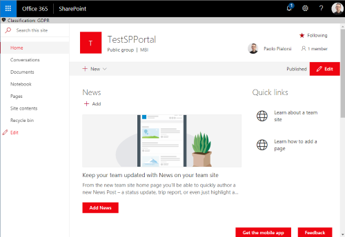

# Site Classification Application Customizer

This application customizer provides you the ability to add a header with site classification information which is pulled from the Classification of modern SharePoint sites property using PnP JS. Learn more about [site classification](https://docs.microsoft.com/en-us/sharepoint/dev/solution-guidance/modern-experience-site-classification)

## Extension details

This extension requires no external dependencies nor requires configuration as there are no custom properties.

| Description | Name | Type | Required | Description |
| ---- | ---- | ---- | ---- | ---- |

# Installing the extension

See getting started from [SP-Starter-Kit repository readme](https://github.com/SharePoint/sp-starter-kit).

You can also download just the [SharePoint Framework solution package (spppkg) file](https://github.com/SharePoint/sp-starter-kit/blob/master/package/sharepoint-starter-kit.sppkg) and install that to your tenant. This extension does not have external dependencies.

> As this is a SharePoint Framework extension, you will need to explicitly enable this extension for a specific site using CSOM or REST APIs. You may also enable this extension via a PnP Provisioning template. See [hubsite.xml provisioning template](../../provisioning/hubsite.xml) for an example.

# Screenshots

# Source Code

https://github.com/SharePoint/sp-starter-kit/tree/master/solution/src/extensions/siteClassification

# Minimal Path to Awesome

- Clone this repository
- Move to Solution folder
- in the command line run:
  - `npm install`
  - `gulp serve`

Since this is an extension, debugging requires slightly more advance settings. Please see more from the official SharePoint development documentation around the [debugging options with SharePoint Framework extensions](https://docs.microsoft.com/en-us/sharepoint/dev/spfx/debug-modern-pages).

# Version history

Version|Date|Comments
-------|----|--------
1.0|May 2018|Initial release

