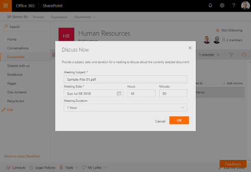

# Discuss Now List View Command Set

This List View Command Set provides you the ability to add a custom dialog to start a discussion on a specific document within a document library by scheduling an event meeting for the group of a specific site.

The event is added to the group by way of the Microsoft Graph.

The command set extension is designed for group associated team sites.




## Extension details

This extension requires access to the Microsoft Graph and must target a specific list template types, such as `101` for document libraries.

| Description | Name | Type | Required | Description |
| ---- | ---- | ---- | ---- | ---- |


# Installing the extension

See getting started from [SP-Starter-Kit repository readme](https://github.com/SharePoint/sp-starter-kit).

You can also download just the [SharePoint Framework solution package (sppkg) file](https://github.com/pnp/sp-starter-kit/blob/master/source/react-command-discuss-now/sharepoint/solution/react-command-discuss-now.sppkg) and install that to your tenant. This extension depends on access to Microsoft Graph.

> As this is a SharePoint Framework extension, you will need to explicitly enable this extension for a specific site using CSOM or REST APIs. 

> You may enable this extension via a PnP Provisioning template. See [collab.xml provisioning template](../../provisioning/collab.xml) for an example.

> You may enable this extension via PnP PowerShell using the `Add-PnPCustomAction` commandlet.

```powershell
$creds = Get-Credential
Connect-PnPOnline https://[yourtenant].sharepoint.com/sites/[yoursite] -Credentials $creds
Add-PnPCustomAction -Title "DiscussNow" -Name "DiscussNow" -Location "ClientSideExtension.ListViewCommandSet" -ClientSideComponentId 130b279d-a5d1-41b9-9fd1-4a274169b117 -RegistrationType List -RegistrationId 101
```

> You may test this extension on a given collaboration site library by running `gulp serve` in powershell within the `./solution` folder, and then adding the querystring `?loadSPFX=true&debugManifestsFile=https://localhost:4321/temp/manifests.js&customActions={"130b279d-a5d1-41b9-9fd1-4a274169b117":{"location":"ClientSideExtension.ListViewCommandSet","properties":{}}}` to the url of a given library. As an example, for the tenant `contoso`, for a collaboration site `hr`: `https://contoso.sharepoint.com/sites/hr/Shared%20Documents/Forms/AllItems.aspx?loadSPFX=true&debugManifestsFile=https://localhost:4321/temp/manifests.js&customActions={%22130b279d-a5d1-41b9-9fd1-4a274169b117%22:{%22location%22:%22ClientSideExtension.ListViewCommandSet%22,%22properties%22:{}}}`


# Screenshots


# Source Code

https://github.com/pnp/sp-starter-kit/tree/master/source/react-command-discuss-now

# Minimal Path to Awesome

- Clone this repository
- Move to Solution folder
- in the command line run:
  - `npm install`
  - `gulp serve`

Since this is an extension, debugging requires slightly more advance settings. Please see more from the official SharePoint development documentation around the [debugging options with SharePoint Framework extensions](https://docs.microsoft.com/en-us/sharepoint/dev/spfx/debug-modern-pages).

# Version history

Version|Date|Comments
-------|----|--------
1.0|May 2018|Initial release


