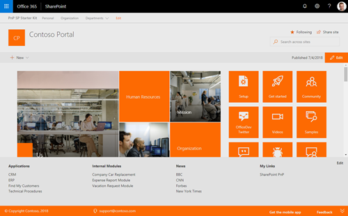

# Portal Footer Application Customizer

This application customizer provides you the ability to include a footer designed for the primary portal or hub site. The footer includes sets of links as well as a copyright statement and support email address.

One set of links provides company wide links which are configured using a common list stored within the hub site. A second set of links are personalized links, unqiue to each user, stored within each user's user profile within a user profile property.

By default, this application customizer is associated with communication sites created using the custom site design i.e. `{Company name} Communication Site`, provided in this project. The custom site design is provisioined as a part of the [deployment process](../../provisioning) while applying the PnP Provisioning template, [hubsite.xml](../../provisioning/hubsite.xml).

## Extension details

This extension is dependent on an explicit `source` list of common links and an explicit `personalItems` user profile property for personal link storage. By default the source list is created during the Starter Kit deployment process. The User Profile property must be [manually created](../../documentation/tenant-settings.md#create-a-custom-property-in-the-user-profile-service).

| Description | Name | Type | Required | Description |
| ---- | ---- | ---- | ---- | ---- |
| Common link list title | linksListTitle | string | yes | Default: PnP-PortalFooter-Links - The name of the list within the current site where common links are stored |
| Copyright Message | copyright | string | yes | Default: (c) Copyright {Company}, 2018 - a copyright message |
| Support Contact | support | string | yes | Default: support@contoso.com - a support or contact email address |
| User Profile Property Name | personalItemsStorageProperty | string | yes | Default: PnP-CollabFooter-MyLinks - The name of the custom user profile property used to store custom footer links |

## Portal Footer Links list details

This extension is dependent on a explicit `PnP-PortalFooter-Links` list that must be located in the root of the current site collection.

| Display Name | Name | Type | Required | Description |
| ---- | ---- | ---- | ---- | ---- |
| Title | Title | string | yes | Link title |
| Link Group | PnPPortalLinkGroup | choice | no | The group for a specific link |
| Link URL| PnPPortalLinkUrl | URL | no | The url for a specific link |

# Installing the extension

See getting started from the [SP-Starter-Kit repository readme](https://github.com/SharePoint/sp-starter-kit).

You can also download the [SharePoint Framework solution package (sppkg) file](https://github.com/pnp/sp-starter-kit/blob/master/source/react-application-portal-footer/sharepoint/solution/react-application-portal-footer.sppkg) and install the SPFx solution to your tenant. This extension depends on a SharePoint list and the user profile to store common and user specific links.

> As this is a SharePoint Framework extension, you will need to explicitly enable this extension for a specific site using CSOM or REST APIs. You may also auto enable this extension with defined custom properties as a part of a site script using the `associateExtension` verb. See [collabcommunicationsite.json Site Script](../../provisioning/resources/collabcommunicationsite.json) for an example.

# Screenshots

# Source Code

https://github.com/pnp/sp-starter-kit/tree/master/source/react-application-portal-footer

# Minimal Path to Awesome

- Clone this repository
- Move to Solution folder
- in the command line run:
  - `npm install`
  - `gulp serve`

Since this is an extension, debugging requires slightly more advance configuration. Please learn more from the official SharePoint development documentation on [debugging options with SharePoint Framework extensions](https://docs.microsoft.com/en-us/sharepoint/dev/spfx/debug-modern-pages).

# Version history

Version|Date|Comments
-------|----|--------
1.0|May 2018|Initial release

