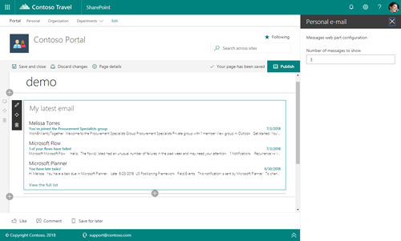

# Personal Email web part

This web part provides you the ability to add a particular user's personal email on a web page. The web part may be configured to display a pre-defined number of emails at a time and includes a link to the user's Outlook to view all email. This web part is powered by the Microsoft Graph and currently requires that the Office 365 tenant be configured for targeted release for all users.

## How to use this web part on your web pages

1. Place the page you want to add this web part to in edit mode.
2. Search for and insert the **Personal Email** web part.
3. Configure the web part to update its properties.

## Configurable Properties

The `Personal Email` web part can be configured with the following properties:

| Label | Property | Type | Required | Description |
| ---- | ---- | ---- | ---- | ---- |
| Personal e-mail | title | string | no | The web part title, editable inline with the web part itself |
| Number of messages to show | nrOfMessages | number | no | Default: 5 - The number of emails to show |

# Installing the web part

See getting started from [SP-Starter-Kit repository readme](https://github.com/SharePoint/sp-starter-kit). 

You can also download just the [SharePoint Framework solution package (sppkg) file](https://github.com/pnp/sp-starter-kit/blob/master/source/react-personal-email/sharepoint/solution/react-personal-email.sppkg) and install that to your tenant. This web part requires access to the Microsoft Graph.

# Screenshots

# Source Code

https://github.com/pnp/sp-starter-kit/tree/master/source/react-personal-email

# Minimal Path to Awesome

- Clone this repository
- Move to Solution folder
- in the command line run:
  - `npm install`
  - `gulp serve`

# Version history

Version|Date|Comments
-------|----|--------
1.0|May 2018|Initial release

