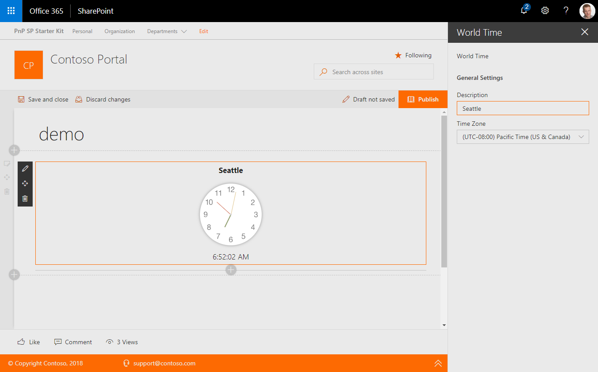

# World Time web part

This web part provides you the ability to display basic clock for a given time zone on a web page. The clock is based on the user's workstation time with an offset from UTC to the selected time zone.

## How to use this web part on your web pages

1. Place the page you want to add this web part to in edit mode.
2. Search for and insert the **World Time** web part.
3. Configure the web part to update its properties.

## Configurable Properties

The `World Time` web part can be configured with the following properties:

| Label | Property | Type | Required | Description |
| ---- | ---- | ---- | ---- | ---- |
| Description | description | string | no | Default: UTC Time - The clock description |
| Time Zone | timeZoneOffset | number | no | Default: 0 - The clock offset where 0 = UTC, -8 = PST (UTC−08:00), etc |

# Installing the web part

See getting started from [SP-Starter-Kit repository readme](https://github.com/SharePoint/sp-starter-kit). 

You can also download just the [SharePoint Framework solution package (sppkg) file](https://github.com/pnp/sp-starter-kit/blob/master/source/react-world-clock/sharepoint/solution/react-world-clock.sppkg) and install that to your tenant.

# Screenshots

# Source Code

https://github.com/pnp/sp-starter-kit/tree/master/source/react-world-clock

# Minimal Path to Awesome

- Clone this repository
- Move to Solution folder
- in the command line run:
  - `npm install`
  - `gulp serve`

# Version history

Version|Date|Comments
-------|----|--------
1.0|May 2018|Initial release

