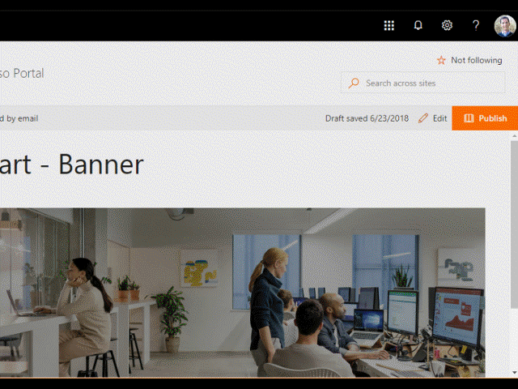

# Banner webpart

This webpart provides you the abilily to add a variable height image banner with a linkable title.

**Banner**

## How to use this webpart on your web pages

1. Place the page you want to add this webpart to in edit mode.
2. Search for and insert the **Banner** webpart.
3. Configure the webpart to update its properties.

## Configurable Properties

The `Banner` webpart can be configured with the following properties:

| Label | Property | Type | Required | Description |
| ---- | ---- | ---- | ---- | ---- |
| Overlay image text | bannerText | string | no | The text message or title you want displayed on the banner image |
| Image URL | bannerImage | string | no | The url of the banner image |
| Link URL | bannerLink | string | no | The hyperlink url of the bannerText link |
| Banner height | bannerHeight | number | no | Provides the fixed height of the banner image |
| Enable parallax effect | useParallax | toggle | no | Enable if you want to include parallax effect on vertical scrolling |

