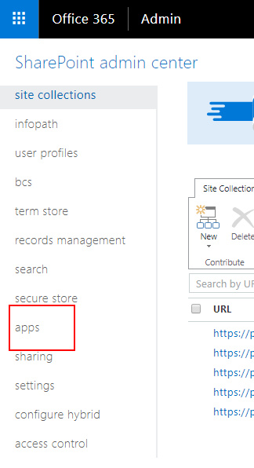
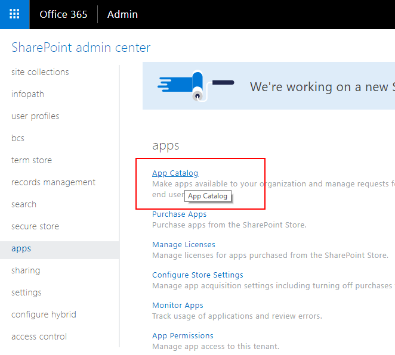
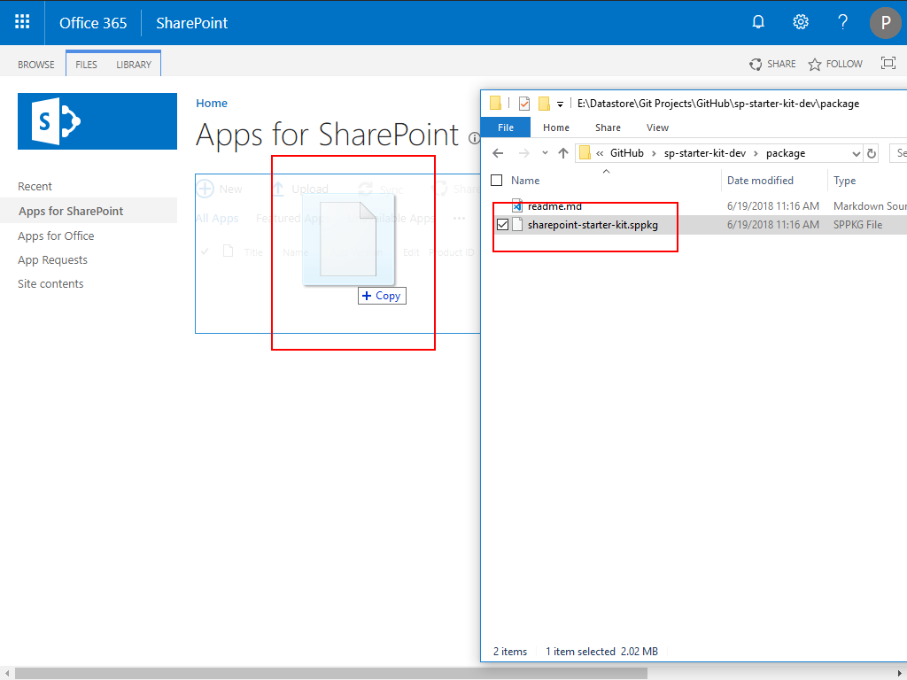
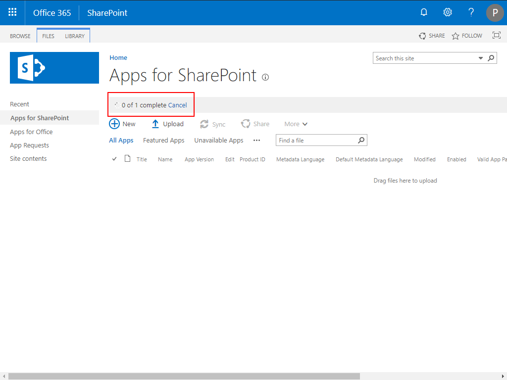
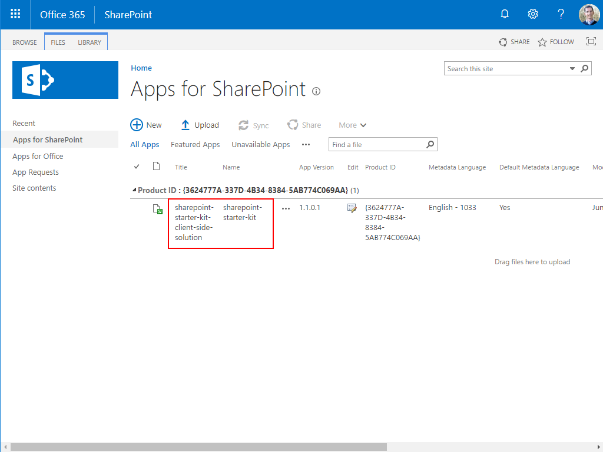
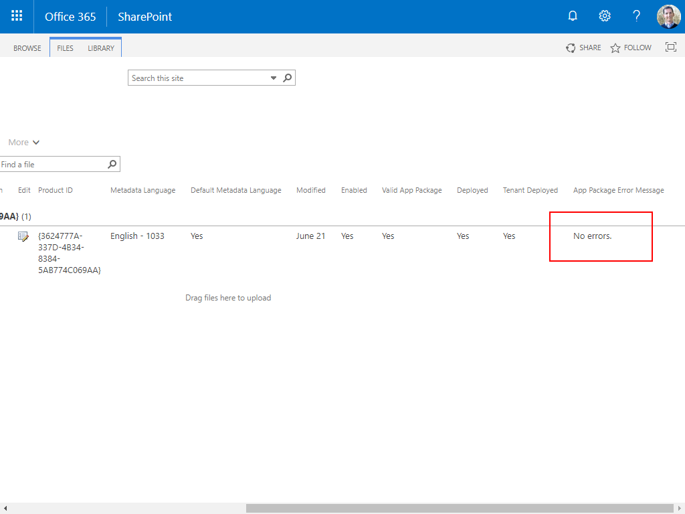

# Manually deploy the SP Starter Kit .sppkg SPFx solution to the tenant App Catalog

The SP Started Kit [`deployment proces`](../provisiniong/readme.md) will automatically rebuild and deploy the included SPFx solution to your tenant app catalog. You can also pre-deploy [`sharepoint-starter-kit.sppkg`](../package/sharepoint-starter-kit.sppkg) from the [`/package`](../package) folder manually to the tenant app catalog, as well as ['manually approve the requested permissions`](api-management.md).

## Pre-requirements

1. You will need tenant admin access.

2. You will already have to have created an Application Catalog from your SharePoint Admin Center. **Note**: A newly created app catalog may take a few minutes to a few hours to fully provision.

SharePoint Admin Center Apps

Create tenant application site

## Manually deploy SP Starter Kit .sppkg

1. Load your tenant app catalog in a browser, i.e. http://[tenant].sharepoint.com/sites/apps

2. Drag and drop [`sharepoint-starter-kit.sppkg`](../package/sharepoint-starter-kit.sppkg) from the [`/package`](../package) folder into your `app catalog`.

3. Wait for the upload to complete.

4. After a successful package upload, you will be asked to trust the solution. You will want to `Make this solution available to all sites in the organization`. Also note that you will need to approve api permissions after 'deploying' the solution.

5. Your solution should now be deployed.

6. Verify no errors were thrown during solution deployment.

7. You should now approve the API permissions found in the [`Service Priniciple Permissions Management Page`](api-management.md) available in the Preview Admin Center.