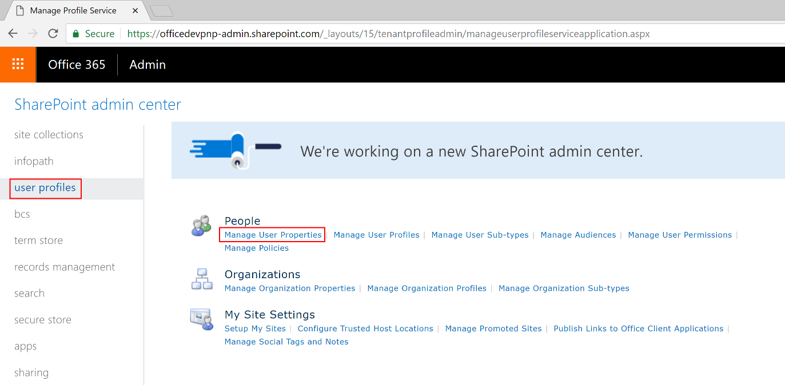
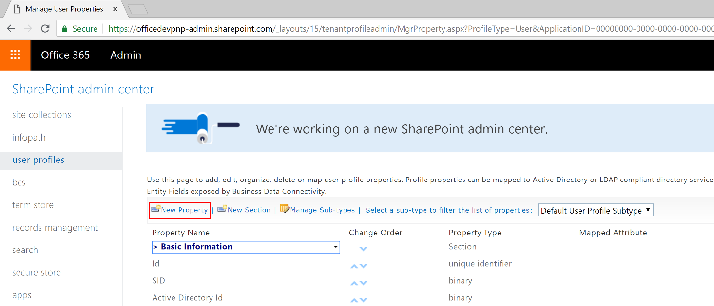

# Preparing your tenant for the PnP SharePoint Starter Kit

In this document you can find detailed information about preparing your tenant to provision and utilize the PnP SharePoint Starter Kit. In the main [ReadMe](./README.md) file of this repository you can find general information about the project.

In fact, here is the list of requirements, which need some manual steps, to be accomplished in order to properly provision the solution:

* You need to [create a custom property in the User Profile Service](#UPSCustomProperty).
* If you want to use the StockInformation Web Part, you need to [request a custom API key to Alpha Vantage](#APIKeyAlphaVantage), which is the provider for live stocks data.

In the following sections you can find detailed instructions about the above tasks.

<a name="UPSCustomProperty"></a>
## Create a Custom Property in the User Profile Service

In order to register a custom property in the User Profile Service, you need to browse with your web browser to the SharePoint Admin Center of SharePoint Online, which is available at the URL https://&lt;tenant-name&gt;-admin.sharepoint.com/.
There, you need to select the *User Profiles* menu item on the left menu and select *Manage User Properties* under the *People* category of links, as you can see in the following figure.



In the *Manage User Properties* page, select to *New Property* create a **New Property** as it is illustrated in the following figure.



Configure the new property with the following settings:

* Name: PnP-CollabFooter-MyLinks
* Display name: PnP-CollabFooter-MyLinks
* Type: string (Single Value)
* Length: 3600 (which is the maximum allowed)
* Policy Setting: Optional
* Allow users to edit values for this property: Checked

Leave all the other properties with their default values.

> Note: We cannot automate this step because it is not yet possible to use the Client Side Object Model, or the REST API of SharePoint Online, to create a custom User Profile property.

<a name="APIKeyAlphaVantage"></a>
## Request a custom API key to Alpha Vantage

The StockInformation Web Part uses the live stocks service provided by [Alpha Advantage](https://www.alphavantage.co/). However, to use it you need a software key, that you can ask for free to the API provider. You will simply need to go to the page to [Claim your API Key](https://www.alphavantage.co/support/#api-key), fill in the form, and store the generated key in a safe place.

The key should be configured at tenant level, by creating a storage entity using the following PowerShell script:

```powershell
Set-PnPStorageEntity -Key "PnP-Portal-AlphaVantage-API-Key" -Value "your-api-key" -Comment "API Key for Alpha Advantage REST Stock service" -Description "API Key for Alpha Advantage REST Stock service"
```
