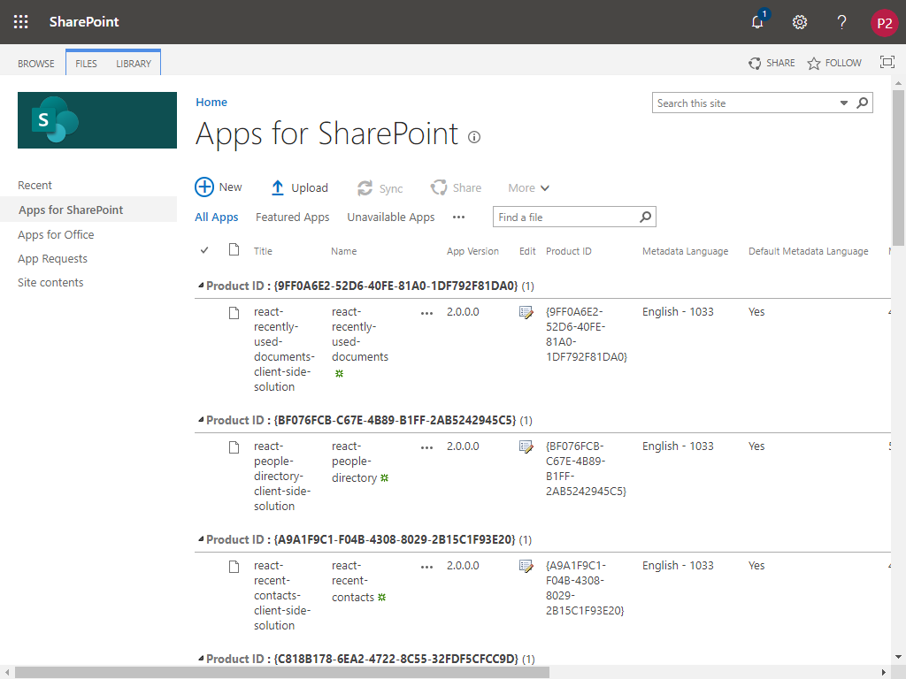

# SP Starter Kit Provisioning Guidance - SharePoint Online - SPFx solution packages only

The following documentation provides guidance related to a secondard provisioning process of the **SP Starter Kit**.

**For SharePoint Online SPFx solution packages only**

Additional installation options exist, including the default provisioning method. Refer to [Choose the right method depending on your requirements](./readme.md#choose-the-right-method-depending-on-your-requirements).

This document provides guidance on installing only the SPFx solution packages (`.sppkg files`) for the **SP Starter Kit** for only **SharePoint Online**. The installation includes one SPFx bundled solution per SPFx component, i.e. webpart, extension, library.

It is recommended you read this entire document before installing the starter kit, in particular pay close attention to [Important notes](#important-notes) and [Fixing provisioning errors](#fixing-provisioning-errors).

# Table of contents

- [Minimal path to success](#minimal-path-to-success)
- [Important notes](#important-notes)
- [Fixing provisioning errors](#fixing-provisioning-errors)

## Minimal path to success

1. Ensure that you have met all **[Pre-requirements](../README.md#pre-requirements)**

2. Open PowerShell and run the following commands, changing the tenant url to your primary SharePoint tenant site.

   In order to successfully install the SP Starter Kit, you are required to install the latest [PnP PowerShell](https://github.com/pnp/powershell) (validated at version 1.12.0 or higher), which can be installed with the following PowerShell command:

   ```powershell
   Install-Module -Name PnP.PowerShell
   ```

3. After successfully installing PnP PowerShell, you need to connect to your tenant **using authorization credentials that have tenant administrative rigths**. This level of access is required to provision taxonomy.

   ```powershell
   Connect-PnPOnline -Url https://[yourtenant].sharepoint.com
   ```

4. Install the spfx only starter kit using the **Invoke-PnPTenantTemplate** PowerShell commandlet from this project's **./provisioning** folder:

   ```powershell
   Invoke-PnPTenantTemplate -Path starterkit-spfx-only.pnp
   ```

5. Upon successful provisioning, no error messages should appear. Validate all solution packages were installed by validating your tenant App Catalog

   


## Important notes

- This provisioning method will not create any new SharePoint sites, nor will it change any existing SharePoint sites.

- This provisioning method is a great example of how to create a custom provisioning template and should be used as a template for your own custom requirements.

- This provisioning template may be modified and repackaged by editing **starterkit-spfx-only.xml** found in this project's **./source/templates** folder. After updating the .xml file, repackage the provisioning template. This may be accomplished with the following PowerShell commandlets:

  ```powershell
  $kit = Read-PnPTenantTemplate -Path ..\source\templates\starterkit-spfx-only.xml
  Save-PnPTenantTemplate -Template $kit -Out yourstarterkit.pnp
  ```

- Ensure the credentials you use to connect to your tenant have **tenant administrative rights**, or be a site collection administrator of the tenant app catalog site collection. This is required to provision to the tenant app catalog.


## Fixing provisioning errors

- If you run into errors during provisioning, refer to ['Common SP Starter Kit Provisioning results'](../documentation/common-provision-results.md) for additional suggestions and common mistakes

- Refer to the ['Issues List'](https://github.com/SharePoint/sp-starter-kit/issues) to see if anyone else has run into a similar issue, and if so possible paths to success

- ['Submit a new issue'](https://github.com/SharePoint/sp-starter-kit/issues) if you are unable to find a solution to your specific error or question