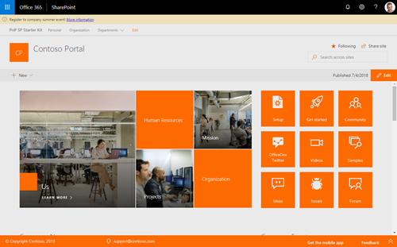

# Alerts Application Customizers

This application customizer provides you the ability to show notifications on content pages in the top / header area within a hub site and its associated sites.

The notifications that are to be displayed are administered via a SharePoint list named "Alerts" that is hosted by a hub site. The "Alerts" list within a hub site supports the hub site and all sites associated with the hub site that have activated the Alerts application customizer.

The default SP Starter Kit installation process will automatically provision the "Alerts" list including a custom content type, "PnP Alert" to the hub site. The hub site and associated collaboration sites provisioned by the starter kit will also have the Alert application customizer extension automatically activated.

New sites added to the hub that wish to include the Alert application customizer will need to activate the extension via a site script, PnP PowerShell, or PnP cli.

> This extension will only work for hub sites or sites that are associated with a hub site.


> Screenshot is from the v1 version.


## Alert list details

This extension is dependent on a explicit `Alerts` list that must be located in a hub site to which current site collection is associated. If site collection is the actual hub site, alerts list has to exist in the root of that site collection.

| Display Name | Name | Type | Required | Description |
| ---- | ---- | ---- | ---- | ---- |
| Alert type | PnPAlertType | choice | yes | Type of Alert to display. Urgent = Red. Information = Yellow. |
| Alert message | PnPAlertMessage | string | yes | The message you want to display in the alert |
| Start date-time | PnPAlertStartDateTime | date time | yes | The Date/Time the alert should show in the header placeholder |
| End date-time | PnPAlertEndDateTime | date time | yes | The Date/Time the alert stops showing in the header placeholder |
| More information link | PnPAlertMoreInformation | URL | no | Provides a clickable link at the end of the alert message |

> Notice that in default SharePoint Starter Kit installation this list is automatically provisioned on the hub site in the case of SharePoint Online solution.

Original v1 implementation located at https://github.com/SharePoint/sp-starter-kit/blob/master/documentation/components/ext-alert.md

In the v2 release, this extension has been repackaged as its own solution to provide more flexibility from deployment perspective.

## Installing the extension

See getting started from [SP-Starter-Kit repository readme](https://github.com/pnp/sp-starter-kit) for basic installation of the SP Starter Kit which includes installing the proper list, "Alerts" to the hub site, installation the application customizer's sppkg to the tenant app catalog, and activating the extension on the hub site and associated team sites.

You can also download just the [extension (sppkg) file](./sharepoint/solution/react-application-alerts.sppkg) and install that to your tenant's app catalog. This extension does not have external dependencies. This extension does require the 'Alerts' list be available in the root of the hub site with the proper site columns as specified in [Alert list details](#Alert-list-details).

> As this is a SharePoint Framework extension, you will need to explicitly enable this extension in a site using CSOM, REST APIs, PnP PowerShell, or PnP cli.

**A common approach to activate the extention on a given site connection is to use PnP PowerShell commandlets:**

  ```powershell
  Connect-PnPOnline https://contosodemosk.sharepoint.com/sites/site-to-configure
  Add-PnPCustomAction -Name "HubOrSiteAlertsApplicationCustomizer" -Title "HubOrSiteAlertsApplicationCustomizer" -ClientSideComponentId 29df5d8b-1d9b-4d32-971c-d66162396ed3 -Location "ClientSideExtension.ApplicationCustomizer" -ClientSideComponentProperties "{}" -Scope Site
  ```

> Set the full url and path of the Connect-PnPOnline commandlet to fit your specific tenant / site


## Screenshots




## Used SharePoint Framework Version


* Supported in SharePoint Online

## Applies to

* [SharePoint Framework](https://learn.microsoft.com/en-us/sharepoint/dev/spfx/sharepoint-framework-overview)
* [Office 365 tenant](https://learn.microsoft.com/en-us/sharepoint/dev/spfx/set-up-your-development-environment)

## Prerequisites

Alert is is created automatically to the root of the site collection if it's missing where the extension is executed. This requires that the person using the extension will have sufficient permissions. If permissions are missing, then application customizer will not render anything.

## Solution

Solution|Author(s)
--------|---------
folder name | Author details
./solution/src/extensions/alertNotification | Waldek Mastykarz @waldekm
./source/react-application-alerts | Robert Schouten @rfjschouten
./source/react-application-alerts | Chandani Prajapati @Chandani_SPD

## Version history

Version|Date|Comments
-------|----|--------
1.0|Appril 1, 2018|Initial release for SharePoint Starter Kit v1
2.0|December 25, 2019|Initial release for SharePoint Starter Kit v2
3.0|February 2023|Initial release for SharePoint Starter Kit v3

## Disclaimer

**THIS CODE IS PROVIDED *AS IS* WITHOUT WARRANTY OF ANY KIND, EITHER EXPRESS OR IMPLIED, INCLUDING ANY IMPLIED WARRANTIES OF FITNESS FOR A PARTICULAR PURPOSE, MERCHANTABILITY, OR NON-INFRINGEMENT.**

---

## Minimal Path to Awesome

* Clone this repository
* Move to correct folder where solution exists
* in the command line run:
  * `npm install`
  * `gulp serve`

## Features

Key features demostrated by this solution:

* PnPjs usage in the solution
* Dynamic creation of the list if it's missing
* SPFx application customizer that includes a header driven by a SharePoint list


