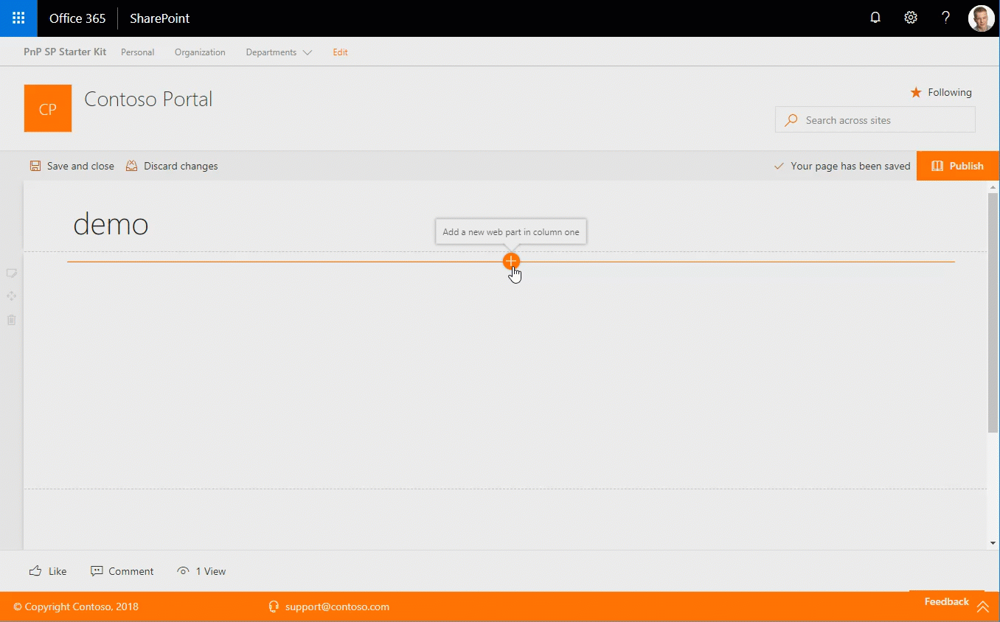

# Followed Sites webpart

This web part provides you the ability to display a list of site administrator defined number of sites that a given user is following, with paging as well as inline filtering of sites by keyword or phrase. Currently the list of followed sites includes classic as well as modern communication sites but does not include group enabled (modern) team sites.

> `NOTE:` This webpart includes the use of a custom SPFx library, [library-starter-kit-shared](../library-starter-kit-shared). If you need to rebuild / bundle / package this solution, refer to [Minimal Path to Awesome](#Minimal-Path-to-Awesome)




## Configurable Properties

The `Followed Sites` webpart can be configured with the following properties:

| Label | Property | Type | Required | Description |
| ---- | ---- | ---- | ---- | ---- |
| Followed Sites | title | string | no | The webpart title, editable inline with the webpart itself |
| Number of followed sites to retrieve | nrOfItems | number | no | The number of sites to show per page, default = 10 |
| Specify the sort order of the retrieved sites | sortOrder | number | no | Preferred site sort order. Default sort order driven by SharePoint, or by site name |

## Used SharePoint Framework Version


* Works only at SharePoint Online due to dependency on Microsoft Graph APIs

## Applies to

* [SharePoint Framework](https:/dev.office.com/sharepoint)
* [Office 365 tenant](https://dev.office.com/sharepoint/docs/spfx/set-up-your-development-environment)

## Prerequisites

* [library-starter-kit-shared](../library-starter-kit-shared) - this is provided by default in the solution. If you need to rebuild / bundle / package this solution, refer to [Minimal Path to Awesome](#Minimal-Path-to-Awesome)


## Minimal Path to Awesome

This solution uses a SPFx library, [library-starter-kit-shared](../library-starter-kit-shared). As such, additional steps are required to rebuild this project.

1. Clone this entire project
2. Within the [library-starter-kit-shared](../library-starter-kit-shared) source, i.e. [./source/library-starter-kit-shared](../library-starter-kit-shared)
  
  ```powershell
  npm install
  gulp build
  gulp bundle
  npm link
  ```

3. Within this SPFx solution folder [react-followed-sites](./), i.e. [./source/react-followed-sites](../react-followed-sites)
  * in the command line run:
  
  ```powershell
  npm install
  npm link @starter-kit/shared-library
  ```

4. Edit package.json found at the root of the [react-followed-sites](./), i.e. [./source/react-followed-sites/package.json](../react-followed-sites/package.json)

  - Add a new dependancy to the project: "@starter-kit/shared-library": "1.0.0"

  **Example**:

  ```xml
    "dependencies": {
      "@microsoft/sp-core-library": "1.9.1",
      ...
      "react": "16.8.5",
      "react-dom": "16.8.5"
    }
  ```

  to:

  ```xml
    "dependencies": {
      "@microsoft/sp-core-library": "1.9.1",
      ...
      "react": "16.8.5",
      "react-dom": "16.8.5",
      "@starter-kit/shared-library": "1.0.0"
    }
  ```

5. Within this SPFx solution folder [react-followed-sites](./), i.e. [./source/react-followed-sites](../react-followed-sites)
  
  * in the command line run:
  
  ```powershell
  gulp serve
  ```

6. To rebundle the webpart, within this SPFx solution folder [react-followed-sites](./), i.e. [./source/react-followed-sites](../react-followed-sites)
  * in the command line run:
  
  ```powershell
  gulp bundle
  gulp package-solution
  ```

> If you add this webpart's sppkg to your app catalog, the sppkg for the [shared library](../library-starter-kit-shared) must also be installed. The [library](../library-starter-kit-shared) may be built, bundled, and packaged similar to a standard SPFx webpart or extension.

> The package.json within this SPFx solution file must be manually updated for if the library dependency was included by default with the project, **npm install** would fail as the [library-starter-kit-shared](../library-starter-kit-shared) package would not be found. Linking the two projects allows this webpart to reference the library during **development**, while the package.json reference is required for **bundling and packaging**.


## Features

Description of the web part with possible additional details than in short summary. 
This Web Part illustrates the following concepts on top of the SharePoint Framework:

* Using Microsoft Graph within a web part
* Using [SharePoint Framework library components](https://docs.microsoft.com/en-us/sharepoint/dev/spfx/library-component-overview_)
* Hosting SharePoint Framework components as Microsoft Teams tabs
* Using app pages in SharePoint Online


## Solution

Solution|Author(s)
--------|---------
react-followed-sites | Elio Struyf
react-followed-sites | Beau Cameron
react-followed-sites | Chandani Prajapati
## Version history

Version|Date|Comments
-------|----|--------
1.0|May, 2018|Initial release
2.0|November 29, 2019| v2.0
3.0|January 17, 2023| Initial release for SharePoint Starter Kit v3 (Upgraded to SPFx 1.16.1)
## Disclaimer

**THIS CODE IS PROVIDED *AS IS* WITHOUT WARRANTY OF ANY KIND, EITHER EXPRESS OR IMPLIED, INCLUDING ANY IMPLIED WARRANTIES OF FITNESS FOR A PARTICULAR PURPOSE, MERCHANTABILITY, OR NON-INFRINGEMENT.**

---


