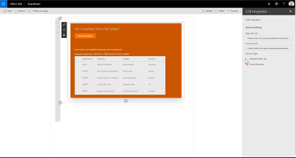
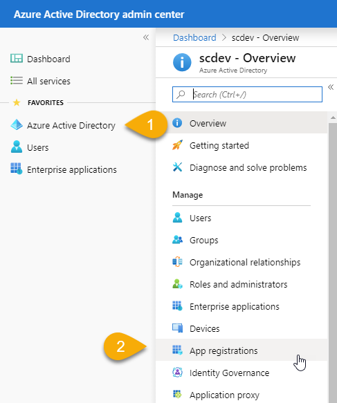
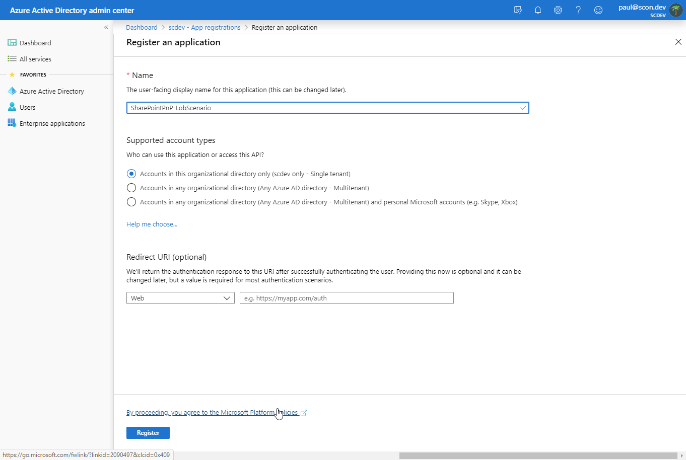
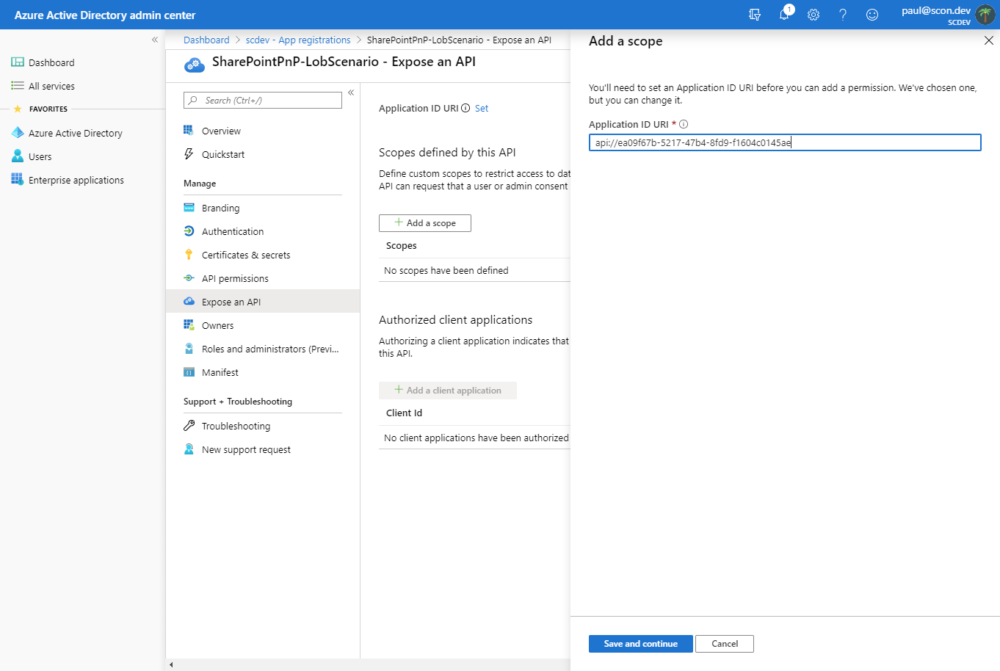
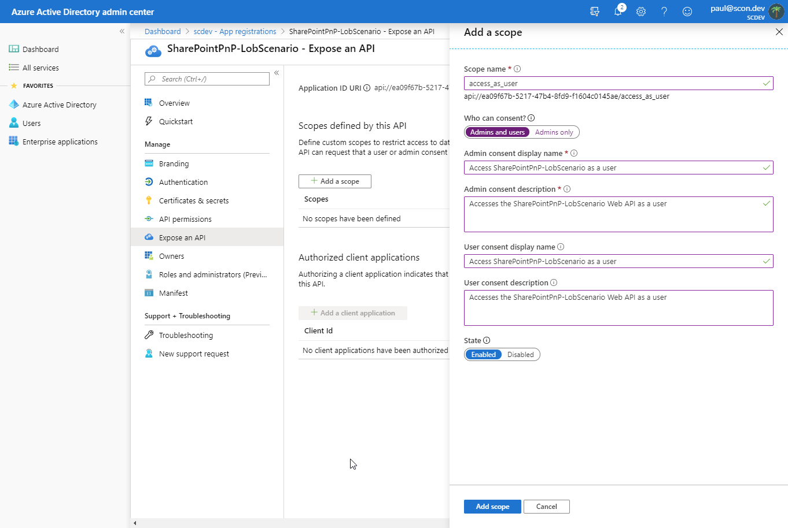
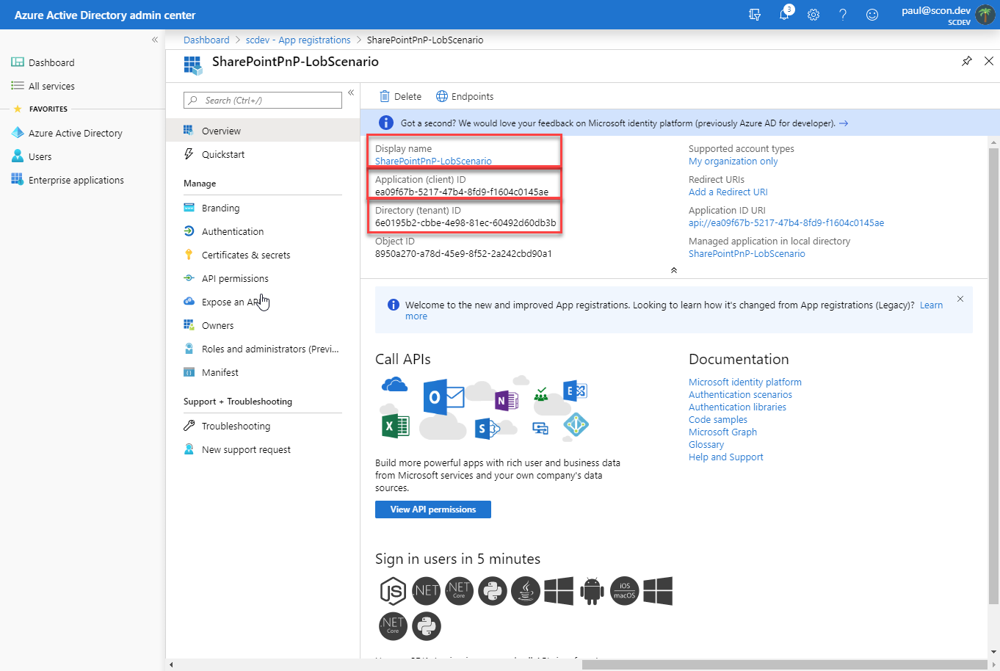

# LOB Integration webpart

The purpose of this web part is to show how you can consume LOB (Line of Business) solutions and external (on-premises, cloud based, etc) data within SharePoint Framework.



The web part leverages a back-end REST API, built using a ASP.NET Core 3.1 WebAPI project that you can find [here](../../sample-lob-service/SharePointPnP.LobScenario/). This API is representative of LOB data exposed via a web service and consumed using Http calls. Visual Studio 2019 version 16.4 or higher required for Visual Studio based deployment to Azure.

## LOB service - Application Registration

The LOB service is protected via the Microsoft Identity Platform. An application registration is required to implement this protection. Peform the following steps to register an application in a tenant.

> If you are not an administrator of a Microsoft 365 tenant, you can get a tenant at no charge as part of the [Microsoft 365 Developer Program](https://developer.microsoft.com/en-us/office/dev-program).

1. Log in to the Azure Active Directory admin center at https://aad.portal.azure.com/.
1. In the left-hand navigation bar, select **Azure Active Directory**, then **App Registrations**.

  

1. Select **New Registration** from the toolbar.
1. Enter a name for the application. In this example, the name is **SharePointPnP-LobScenario**. 
    > This value, known as the **_Application Name_**, is required later in the SharePoint Service Principal configuration.
1. For **Supported account types**, select **Accounts in this organizational directory only (Single tenant)**.
1. Select **Register**.

  

1. In the application overview blade, select **Expose an API**.
1. Select **Add a scope**.
1. The portal will display a panel requesting an Application ID URI. Leave the suggested default (`api://{app-id}`).
    > This value, known as the **_Application URI_**, is required as a web part property.
1. Select **Save and continue**.

  

1. For **Scope name**, enter `access_as_user`.
    > This value, known as the **_Application Scope_**, is required later in the SharePoint Service Principal configuration.
1. Complete the Consent fields as appropriate. 
1. Select **Add scope** to complete the configuration.

  

1. Select **Overview** in the application menu. Make note of the following values for configuring the service code:
   1. Application (client) ID
   1. Directory (tenant) ID

  

## LOB service - Code configuration

The [LOB service](../../sample-lob-service/SharePointPnP.LobScenario/) code must be configured with the application registration values.

1. Open the `appsettings.json` file.
1. Set the TenantId property to the **_Directory (tenant) ID_** value.
1. Set the ClientId property to the **_Application (client) ID_** value.

Once updated, deploy or start the solution. The service must use the https scheme. Make note of the address (url).

> This value, known as the **_Service Url_**, is required as a web part property.

## SharePoint Service Principal configuration
  
The SharePoint Service Principal must have a permission grant before getting an access token for the service. The following PowerShell commands will configure the service principal (the **Resource** and **Scope** parameters must match the values from the application registration):

```PowerShell
Connect-SPOService -Url "https://[your-tenant]-admin.sharepoint.com/"

Approve-SPOTenantServicePrincipalPermissionGrant -Resource "[Application Name]" -Scope "[Application Scope]"
```

## How to use this web part on your web pages

1. Place the page you want to add this web part to in edit mode.
2. Search for and insert the **LobIntegration** web part.
3. Configure the webpart to update its properties.

## Configurable Properties

The `LobIntegration` webpart must be configured with the following properties:

| Label           | Property   | Type   | Required | Description |
| --------------- | ---------- | ------ | -------- | ----------- |
| Service Url     | serviceUrl | string | yes      | The hosting address of the LOB service. (The address must use the https scheme.)        |
| Application URI | webapiUri  | string | yes      | The value from the application registration in the Azure Active Directory admin center. |

## Used SharePoint Framework Version


* SharePoint Online only due to dependency on API permission management

## Applies to

* [SharePoint Framework](https:/dev.office.com/sharepoint)
* [Office 365 tenant](https://dev.office.com/sharepoint/docs/spfx/set-up-your-development-environment)

## Prerequisites

WebAPI configured as secured asset in the same Azure AD instance as where web part is hosted.

## Solution

Solution|Author(s)
--------|---------
react-lob-integration | Paul Schaeflein (Technical Architect, AddIn365) / Microsoft MVP (Office Development) / @paulschaeflein
react-lob-integration | Chandani Prajapati / @Chandani_SPD

## Version history

Version|Date|Comments
-------|----|--------
2.0|December 25, 2019|Initial release
3.0|February 2023|Initial release for SharePoint Starter Kit v3 (Upgraded to SPFx 1.16.1)

## Disclaimer

**THIS CODE IS PROVIDED *AS IS* WITHOUT WARRANTY OF ANY KIND, EITHER EXPRESS OR IMPLIED, INCLUDING ANY IMPLIED WARRANTIES OF FITNESS FOR A PARTICULAR PURPOSE, MERCHANTABILITY, OR NON-INFRINGEMENT.**

---

## Minimal Path to Awesome

* Clone this repository
* Move to solution folder
* in the command line run:
  * `npm install`
  * `gulp serve`

> Include any additional steps as needed.

## Features

Description of the web part with possible additional details than in short summary. 
This Web Part illustrates the following concepts on top of the SharePoint Framework:

* Calling securely custom Web APIs in SharePoint Online from SharePoint Framework solutions


