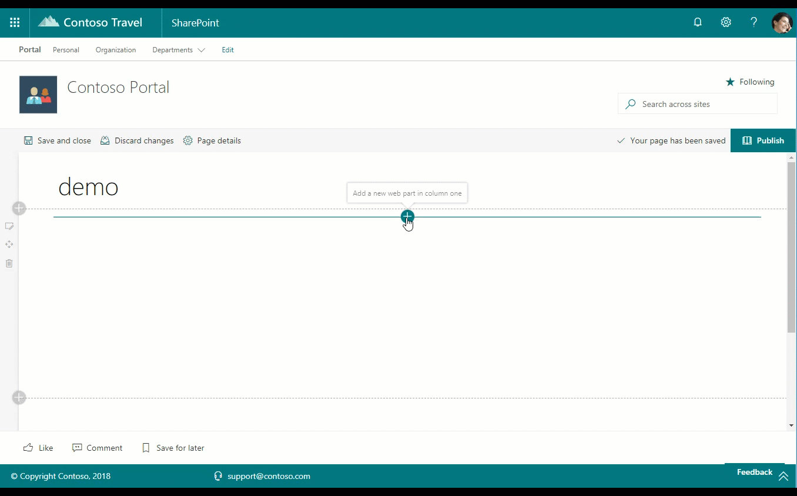

# Personal Contacts web part

This web part provides you the ability to add a particular user's personal contacts on a web page. The web part may be configured to display a pre-defined number of contacts at a time. This web part is powered by the Microsoft Graph and currently requires that the Office 365 tenant be configured for targeted release for all users.

## How to use this web part on your web pages

1. Place the page you want to add this web part to in edit mode.
2. Search for and insert the **Personal Contacts** web part.
3. Configure the web part to update its properties.

## Configurable Properties

The `Personal Contacts` web part can be configured with the following properties:

| Label | Property | Type | Required | Description |
| ---- | ---- | ---- | ---- | ---- |
| Personal contacts | title | string | no | The web part title, editable inline with the web part itself |
| Number of contacts to show | nrOfContacts | number | no | Default: 5 - The number of contacts to show |

## Used SharePoint Framework Version

* Only supported in SharePoint Online due to dependency on the Microsoft Graph APIs

## Applies to

* [SharePoint Framework](https:/dev.office.com/sharepoint)
* [Office 365 tenant](https://dev.office.com/sharepoint/docs/spfx/set-up-your-development-environment)

## Prerequisites

none

## Solution

Solution|Author(s)
--------|---------
react-personal-contacts | Waldek Mastykarz ([@waldekm](https://twitter.com/waldekm))
react-personal-contacts | Vardhaman Deshpande ([@vrdmn](https://twitter.com/vrdmn))
react-presonal-contacts | Don Kirkham ([@DonKirkham](https://twitter.com/donkirkham))
react-presonal-contacts | Chandani Prajapati ([@Chandani_SPD](https://twitter.com/Chandani_SPD))

## Version history

Version|Date|Comments
-------|----|--------
1.0|May 2018| Initial release
2.0|January 2020| Upgrade to V2
3.0|February 2022| Upgrade to SPFx1.13.1
4.0|January 16, 2013|Initial release for SharePoint Starter Kit v3 (Upgraded to SPFx 1.16.1)

## Disclaimer

**THIS CODE IS PROVIDED *AS IS* WITHOUT WARRANTY OF ANY KIND, EITHER EXPRESS OR IMPLIED, INCLUDING ANY IMPLIED WARRANTIES OF FITNESS FOR A PARTICULAR PURPOSE, MERCHANTABILITY, OR NON-INFRINGEMENT.**

---

## Minimal Path to Awesome

* Clone this repository
* Move to solution folder
* in the command line run:
  * `npm install`
  * `gulp serve`

> Include any additional steps as needed.

## Features

This Web Part illustrates the following concepts on top of the SharePoint Framework:

* Using Microsoft Graph from the web parts
* Hosting SharePoint Framework components as Microsoft Teams tabs
* Using app pages in SharePoint Online

## Permissions Requested

Resource | Permission
--------|---------
Microsoft Graph | Contacts.Read

