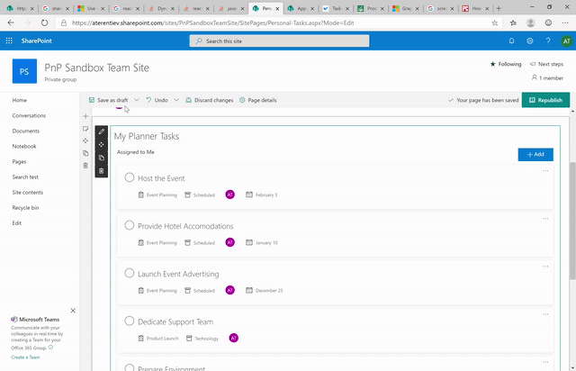

# Personal Tasks web part

This web part provides you the ability to add a particular user's personal tasks on a web page. The web part may be configured to show tasks from Planner or To Do. This web part is powered by the Microsoft Graph.

This webpart is a technology demostrator of Microsoft Graph Toolkit React components, in particular "Tasks". This webpart uses the @microsoft/mgt-react and @microsoft/mgt-spfx packages, currently version 2.9.0.

> `NOTE:` This webpart includes the use the Microsoft Graph Toolkit with React, [@microsoft/mgt-react](https://www.npmjs.com/package/@microsoft/mgt-react).

> `NOTE:` This webpart includes the use the Microsoft Graph Toolkit with React SPFx, [@microsoft/mgt-spfx](../mgt-spfx/README.md) with a dependency on [mgt-spfx-2.9.0.sppkg](https://github.com/microsoftgraph/microsoft-graph-toolkit/releases) that must be installed to the tenant app catalog. By default the Starter Kit will install this additional dependency.

## How to use this web part on your web pages

1. Place the page you want to add this web part to in edit mode.
2. Search for and insert the **Personal Tasks** web part.
3. Configure the web part to update its properties.

## Configurable Properties

The `Personal Tasks` web part can be configured with the following properties:

| Label | Property | Type | Required | Description |
| ---- | ---- | ---- | ---- | ---- |
| My Tasks | title | string | no | The web part title, editable inline with the web part itself |
| Data source | dataSource | 'planner' \| 'todo' | yes | Web part's data source: Planner or To Do. Default: planner |
| Allow editing | allowEditing | boolean | no | Flag if editing is allowed. Default is false. |
| Hide filter | hideHeader | boolean | no | Flag if the header on MS Graph Toolkit Personal Tasks component should be hidden. The header contains a filter and "Add" button. Default is true. |
| Initially displayed Plan or ToDo Folder id | initialId | string | no | A string id to set the initially displayed planner or folder to the provided ID. |
| Initially displayed bucket id | initialBucketId | string | no | A string id to set the initially displayed bucket (Planner Data-Source Only) to the provided ID. |
| Source Plan or ToDo Folder id | targetId | string | no | A string id to lock the tasks interface to the provided planner or folder ID. |
| Source bucket id | targetBucketId | string | no | A string ID to lock the tasks interface to the provided bucket ID (Planner Data-Source Only). |

## Configuration suggestions

* When "hide filter" is selected, the filter header will be hidden from view (default setting). With the filter hidden, you remove the ability for a visitor to filter task results by all tasks or tasks for the current user. By default, if a planner id is not specified, a visitor will see only their tasks. If a specific planner id is set in the webpart properties, all tasks within that planner are displayed. To allow for filtering in this scenario, you will want to sure that the filter is not hidden (unchecked).

## Used SharePoint Framework Version

* Supported in SharePoint Online

## Applies to

* [SharePoint Framework](https://learn.microsoft.com/en-us/sharepoint/dev/spfx/sharepoint-framework-overview)
* [Office 365 tenant](https://learn.microsoft.com/en-us/sharepoint/dev/spfx/set-up-your-development-environment)

## Prerequisites

* [mgt-spfx-2.9.0.sppkg](https://github.com/microsoftgraph/microsoft-graph-toolkit/releases) must be installed to the tenant app catalog. By default the Starter Kit will install this additional dependency.

## Solution

Solution|Author(s)
--------|---------
react-personal-tasks | Waldek Mastykarz
react-personal-tasks | Alex Terentiev
react-personal-tasks | Eric Overfield
react-personal-tasks | Chandani Prajapati

## Version history

Version|Date|Comments
-------|----|--------
1.0|December 25, 2019|Initial release
2.2|August 2021|Upgrade to MGT 2.2.1
3.0|February 2023|Initial release for SharePoint Starter Kit v3 (Upgraded to SPFx 1.16.1 and MGT 2.9.0)

## Disclaimer

**THIS CODE IS PROVIDED *AS IS* WITHOUT WARRANTY OF ANY KIND, EITHER EXPRESS OR IMPLIED, INCLUDING ANY IMPLIED WARRANTIES OF FITNESS FOR A PARTICULAR PURPOSE, MERCHANTABILITY, OR NON-INFRINGEMENT.**

---

## Minimal Path to Awesome

* Clone this repository
* Move to solution folder
* in the command line run:
  * `npm install`
  * `gulp bundle`
  * `gulp package-solution`
  * Upload solution to the SharePoint App Catalog
  * Approve needed permissions in SharePoint Admin Center
  * `gulp serve`

## Features

Description of the web part with possible additional details than in short summary. 
This Web Part illustrates the following concepts on top of the SharePoint Framework:

* Using Microsoft Graph Toolkit from the web parts
* Hosting SharePoint Framework components as Microsoft Teams tabs
* Using app pages in SharePoint Online

