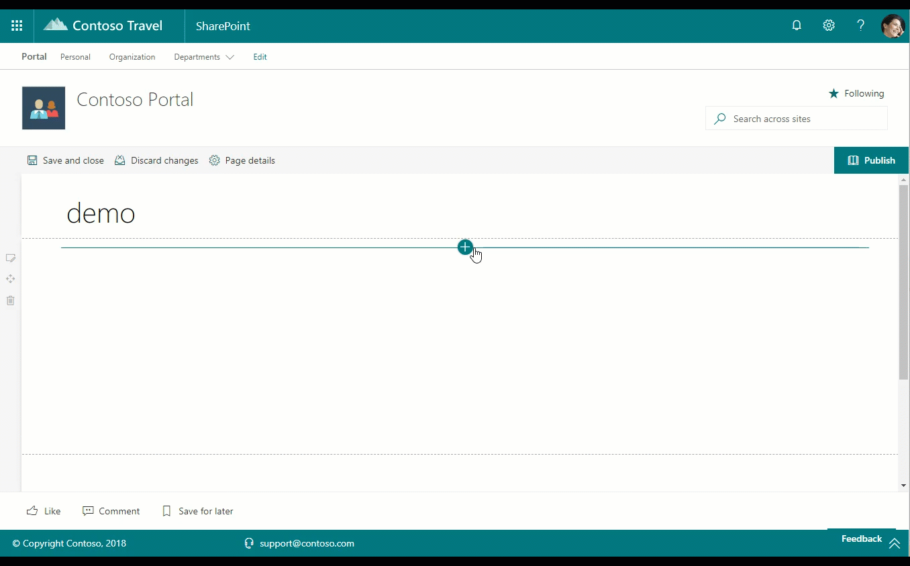

# Recent Contacts web part

This web part provides you the ability to display list of a particular user's recent contacts on a web page. The web part may be configured to display a pre-defined number of contacts at a time. This web part is powered by the Microsoft Graph, in particular the **/me/people** endpoint

This webpart is a technology demostrator of Microsoft Graph Toolkit React components, in particular "Get" and "Person". This webpart uses the @microsoft/mgt-react and @microsoft/mgt-spfx packages, currently version 2.9.0.

> `NOTE:` This webpart includes the use the Microsoft Graph Toolkit with React, [@microsoft/mgt-react](https://www.npmjs.com/package/@microsoft/mgt-react).

> `NOTE:` This webpart includes the use the Microsoft Graph Toolkit with React SPFx, [@microsoft/mgt-spfx](../mgt-spfx/README.md) with a dependency on [mgt-spfx-2.9.0.sppkg](https://github.com/microsoftgraph/microsoft-graph-toolkit/releases) that must be installed to the tenant app catalog. By default the Starter Kit will install this additional dependency.

## How to use this web part on your web pages

1. Place the page you want to add this web part to in edit mode.
2. Search for and insert the **Recent Contacts** web part.
3. Configure the web part to update its properties.

## Configurable Properties

The `Recent Contacts` web part can be configured with the following properties:

| Label | Property | Type | Required | Description |
| ---- | ---- | ---- | ---- | ---- |
| Recent contacts | title | string | no | The web part title, editable inline with the web part itself |
| Specify the number of contacts to show | nrOfContacts | number | no | Default: 5 - The number of contacts to show |

## Used SharePoint Framework Version

* Supported in SharePoint Online

## Applies to

* [SharePoint Framework](https://learn.microsoft.com/en-us/sharepoint/dev/spfx/sharepoint-framework-overview)
* [Office 365 tenant](https://learn.microsoft.com/en-us/sharepoint/dev/spfx/set-up-your-development-environment)

## Prerequisites

* [mgt-spfx-2.9.0.sppkg](https://github.com/microsoftgraph/microsoft-graph-toolkit/releases) must be installed to the tenant app catalog. By default the Starter Kit will install this additional dependency.

Permissions to Microsoft Graph - scope: "People.Read" and "User.Read"

## Solution

Solution|Author(s)
--------|---------
solution/src/webparts/recentContacts | Elio Struyf (@estruyf)
solution/src/webparts/recentContacts | Waldek Mastykarz (@waldekm)
solution/src/webparts/recentContacts | Simon Agren (@agrenpoint)
solution/src/webparts/recentContacts | Jérémy Crestel (@j_crestel)
solution/src/webparts/recentContacts | Daniel Laskewitz (@laskewitz)
solution/src/webparts/recentContacts | Vardhaman Deshpande (@vrdmn)
solution/src/webparts/recentContacts | Jakob Nøtseth (@net_freak)
solution/src/webparts/recentContacts | Mikael Svenson (@mikaelsvenson)
solution/src/webparts/recentContacts | Özgür Ersoy (@moersoy)
solution/src/webparts/recentContacts | Guido Zambarda
source/react-recent-contacts | Yannick Reekmans (@yannickreekmans)
react-recent-contacts | Chandani Prajapati (@Chandani_SPD)

## Version history

Version|Date|Comments
-------|----|--------
1.0|April 7, 2018|Initial release
2.0|December 4, 2019|v2.0
3.0|February 2023|Initial release for SharePoint Starter Kit v3 (Upgraded to SPFx 1.16.1)

## Disclaimer

**THIS CODE IS PROVIDED *AS IS* WITHOUT WARRANTY OF ANY KIND, EITHER EXPRESS OR IMPLIED, INCLUDING ANY IMPLIED WARRANTIES OF FITNESS FOR A PARTICULAR PURPOSE, MERCHANTABILITY, OR NON-INFRINGEMENT.**

---

## Minimal Path to Awesome

* Clone this repository
* Move to solution folder
* in the command line run:
  * `npm install`
  * `gulp serve`

## Features

Description of the web part with possible additional details than in short summary. 
This Web Part illustrates the following concepts on top of the SharePoint Framework:

* Using Microsoft Graph and the Microsoft Graph Toolkit React components within a web part
* Using Webpack Chunking for bundle management
* Using PnP Property Controls (number)

