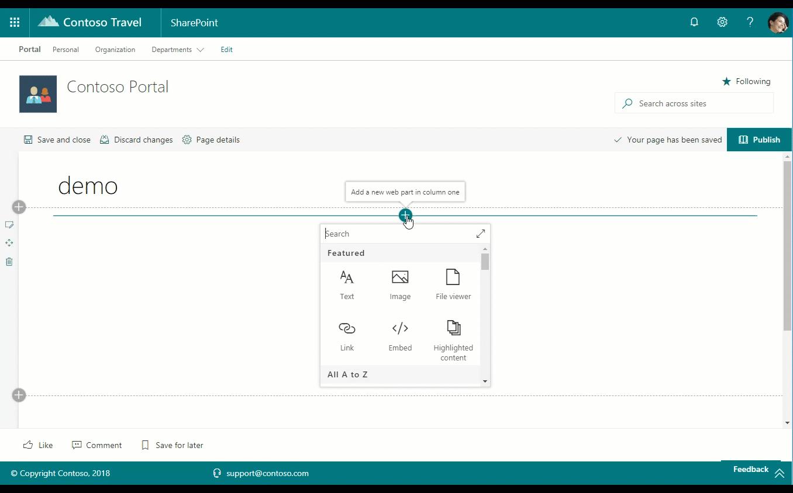

# Recently Used Documents web part

This web part provides you the ability to display a list of a particular user's recently used documents on a web page. The web part may be configured to display a pre-defined number of documents at a time. This web part is powered by the Microsoft Graph and uses the me/insights/used Graph endpoint, while filtering out document types including: "Web", "spsite", "Folder", "Archive", "Image", and "Other".

## How to use this web part on your web pages

1. Place the page you want to add this web part to in edit mode.
2. Search for and insert the **Recently Used Documents** web part.
3. Configure the web part to update its properties.

## Configurable Properties

The `Recently Used Documents` web part can be configured with the following properties:

| Label | Property | Type | Required | Description |
| ---- | ---- | ---- | ---- | ---- |
| Recent Documents | title | string | no | The web part title, editable inline with the web part itself |
| Specify the number of documents to show | nrOfItems | number | no | Default: 3 - The number of documents to show |

## Used SharePoint Framework Version

* Supported in SharePoint Online

## Applies to

* [SharePoint Framework](https://learn.microsoft.com/en-us/sharepoint/dev/spfx/sharepoint-framework-overview)
* [Office 365 tenant](https://learn.microsoft.com/en-us/sharepoint/dev/spfx/set-up-your-development-environment)

## Prerequisites

Permissions to Microsoft Graph - scope: "Sites.Read.All"

## Solution

Solution|Author(s)
--------|---------
solution/src/webparts/recentlyUsedDocuments | Elio Struyf (@struyf)
react-recently-used-documents | Sébastien Levert (@sebastienlevert)
react-recently-used-documents | Chandani Prajapati (@Chandani_SPD)

## Version history

Version|Date|Comments
-------|----|--------
1.0|March 28, 2018|Initial release
2.0|December 29, 2019|v2.0
3.0|February 2023|Initial release for SharePoint Starter Kit v3 (Upgraded to SPFx 1.16.1)

## Disclaimer

**THIS CODE IS PROVIDED *AS IS* WITHOUT WARRANTY OF ANY KIND, EITHER EXPRESS OR IMPLIED, INCLUDING ANY IMPLIED WARRANTIES OF FITNESS FOR A PARTICULAR PURPOSE, MERCHANTABILITY, OR NON-INFRINGEMENT.**

---

## Minimal Path to Awesome

* Clone this repository
* Move to solution folder
* in the command line run:
  * `npm install`
  * `gulp serve`

## Features

Description of the web part with possible additional details than in short summary. 
This Web Part illustrates the following concepts on top of the SharePoint Framework:

* Using Microsoft Graph from the web parts with queries and filters
* Using Lists from FluentUI
* Using Webpack Chunking for bundle management
* Using PnP Property Controls (number)

