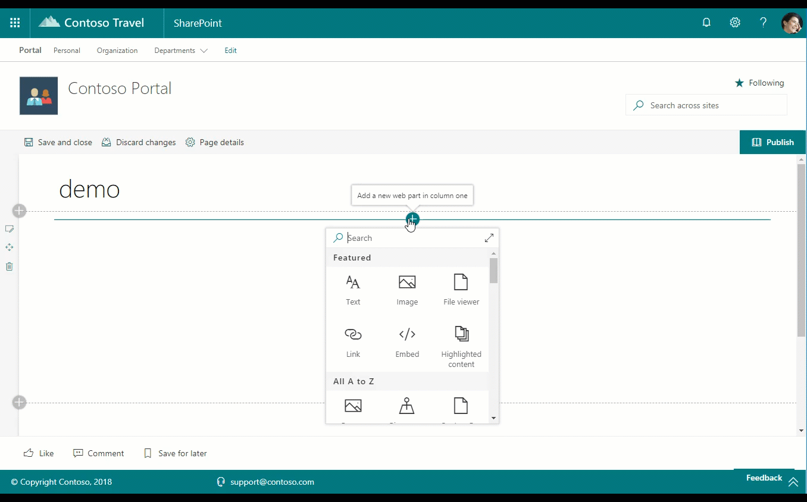

# Recently Visited Sites web part

This web part provides you the ability to display a list of a particular user's recently visited sites on a web page. The web part will display up to the first 30 (thirty) recently visited sites at a time. This web part is powered by the Microsoft Graph and uses the **v1.0/me/insights/used** endpoint.

## How to use this web part on your web pages

1. Place the page you want to add this web part to in edit mode.
2. Search for and insert the **Recently Visited Sites** web part.
3. Configure the web part to update its properties.

## Configurable Properties

The `Recently Visited Sites` web part can be configured with the following properties:

| Label | Property | Type | Required | Description |
| ---- | ---- | ---- | ---- | ---- |
| Recent Sites | title | string | no | The web part title, editable inline with the web part itself |

## Used SharePoint Framework Version

* Supported in SharePoint Online

## Applies to

* [SharePoint Framework](https://learn.microsoft.com/en-us/sharepoint/dev/spfx/sharepoint-framework-overview)
* [Office 365 tenant](https://learn.microsoft.com/en-us/sharepoint/dev/spfx/set-up-your-development-environment)

## Prerequisites

none

## Solution

Solution|Author(s)
--------|---------
solution/src/webparts/recentContacts | Elio Struyf (@estruyf)
solution/src/webparts/recentContacts | Waldek Mastykarz (@waldekm)
solution/src/webparts/recentContacts | Simon Agren (@agrenpoint)
solution/src/webparts/recentContacts | Jérémy Crestel (@j_crestel)
solution/src/webparts/recentContacts | Daniel Laskewitz (@laskewitz)
solution/src/webparts/recentContacts | Jakob Nøtseth (@net_freak)
solution/src/webparts/recentContacts | Mikael Svenson (@mikaelsvenson)
solution/src/webparts/recentContacts | Özgür Ersoy (@moersoy)
solution/src/webparts/recentContacts | Guido Zambarda
source/react-recent-contacts | Yannick Reekmans (@yannickreekmans)
react-recently-visited-sites | Chandani Prajapati (@Chandani_SPD)

## Version history

Version|Date|Comments
-------|----|--------
1.0|April 7, 2018|Initial release
2.0|December 4, 2019|v2.0
3.0|February 2023|Initial release for SharePoint Starter Kit v3 (Upgraded to SPFx 1.16.1)

## Disclaimer

**THIS CODE IS PROVIDED *AS IS* WITHOUT WARRANTY OF ANY KIND, EITHER EXPRESS OR IMPLIED, INCLUDING ANY IMPLIED WARRANTIES OF FITNESS FOR A PARTICULAR PURPOSE, MERCHANTABILITY, OR NON-INFRINGEMENT.**

---

## Minimal Path to Awesome

* Clone this repository
* Move to solution folder
* in the command line run:
  * `npm install`
  * `gulp serve`

> Include any additional steps as needed.

## Features

Description of the web part with possible additional details than in short summary. 
This Web Part illustrates the following concepts on top of the SharePoint Framework:

* Using Microsoft Graph from the web parts using msGraphClientFactory

