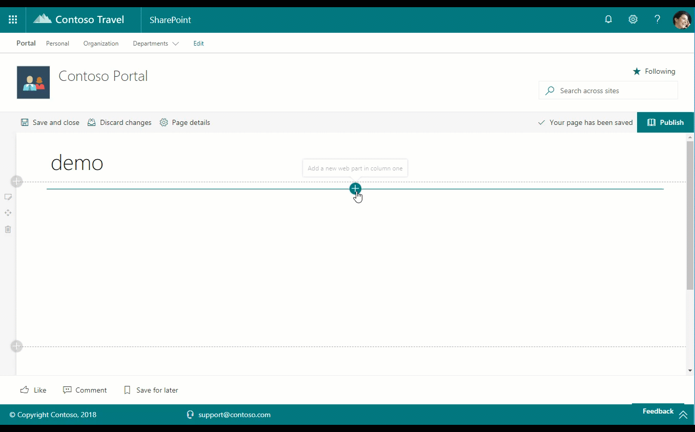

# Site Information web part

This web part provides you the ability to collect and present additional metadata on a web page for group associated team sites. The web part may be configured to display site title, a site contacts powered by a people picker, and a term from the term store, often used to provide classification for the site.

This web part is intended to be used once within a group associated team site to provide additional metadata. This web part provides an extensability framework in which to customize the web part code base to include additional properties and thus site metadata. Additional method demonstrations include the PnP Property Control people picker and the PnP Property Control term picker.

The term store must include the term group name, `PnPTermSets`, which incudes a Term Set, `PnP-Organizations`. Terms should be placed within this term set. The term group, term set, and default terms are added by the Starter Kit provisioning process, in particular set within the `./provisioning/terms.xml` provisioning template. You can also create these terms manually, if you independently use this web part without other starter kit capabilities. 

## How to use this web part on your web pages

1. Place the page you want to add this web part to in edit mode.
2. Search for and insert the **Site Information** web part.
3. Configure the web part to update its properties.

## Configurable Properties

The `Site Information` web part can be configured with the following properties:

| Label | Property | Type | Required | Description |
| ---- | ---- | ---- | ---- | ---- |
| Site Title | siteTitle | string | no | Default: Contoso Portal - the title of the site |
| Site Contact | siteContact | IPropertyFieldGroupOrPerson[] | no | A site contact based on a people picker |
| Site Organization | siteOrganization | IPickerTerms | no | The site's organization, based on a taxonomy termset |

## Used SharePoint Framework Version

* Supported in SharePoint Online

## Applies to

* [SharePoint Framework](https://learn.microsoft.com/en-us/sharepoint/dev/spfx/sharepoint-framework-overview)
* [Office 365 tenant](https://learn.microsoft.com/en-us/sharepoint/dev/spfx/set-up-your-development-environment)

## Prerequisites

This solution relies on a term set named **PnP-Organizations** found within the term group **PnPTermSets**. These terms are added by default during a standard provisioning of the [PnP Starter Kit](../../provisioning). If you have not applied the starterkit.pnp package you can find the xml used to provision the terms [here](../templates/starterkit.xml)

## Solution

Solution|Author(s)
--------|---------
react-site-information | Paolo Pialorsi
react-site-information | David Warner II
react-site-information | Chandani Prajapati

## Version history

Version|Date|Comments
-------|----|--------
1.0|April 7, 2018|Initial release
2.0|December 3, 2019|v2.0
3.0|February 2023|Initial release for SharePoint Starter Kit v3 (Upgraded to SPFx 1.16.1)

## Disclaimer

**THIS CODE IS PROVIDED *AS IS* WITHOUT WARRANTY OF ANY KIND, EITHER EXPRESS OR IMPLIED, INCLUDING ANY IMPLIED WARRANTIES OF FITNESS FOR A PARTICULAR PURPOSE, MERCHANTABILITY, OR NON-INFRINGEMENT.**

---

## Minimal Path to Awesome

* Clone this repository
* Move to solution folder
* in the command line run:
  * `npm install`
  * `gulp serve`

## Features

This Web Part illustrates the following concepts on top of the SharePoint Framework:

* PnP Property Controls - @pnp/spfx-property-controls: Term picker and People picker

