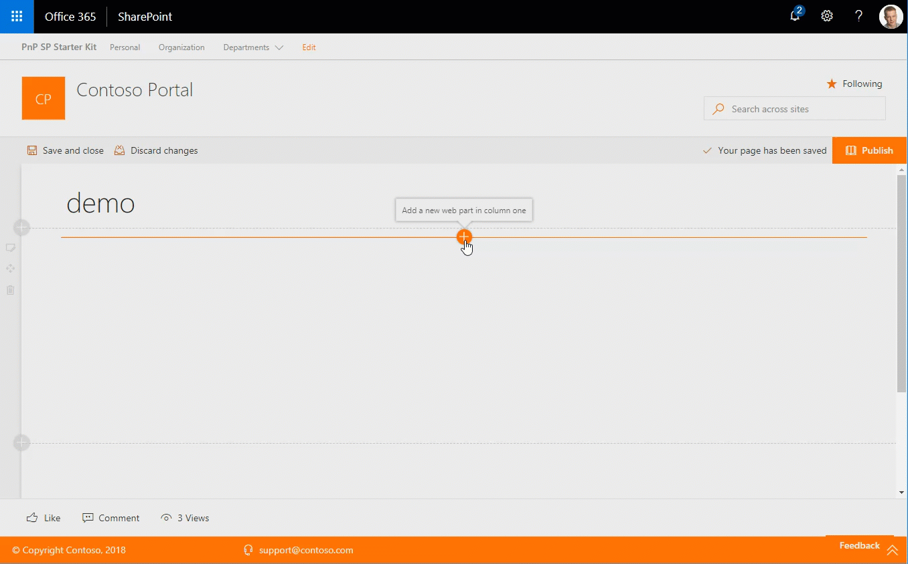
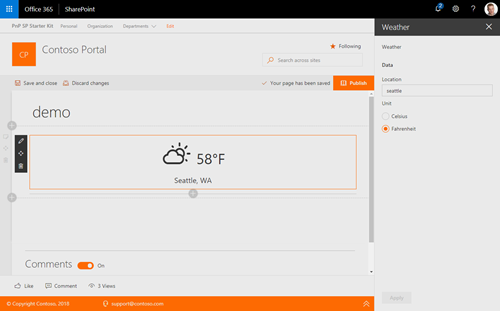

# Weather Information web part

This web part provides you the ability to display basic weather information for one location on a web page. The web part depends on a service provided by [OpenWeatherMap API](https://openweathermap.org/current/). The API requires authentication, and for that reason it is necessary to register for free plan to be able to obtain API Key that will be used to authenticate the calls. API Key has to be entered in web part configuration.

## How to use this web part on your web pages

1. Place the page you want to add this web part to in edit mode.
2. Search for and insert the **Weather** web part.
3. Configure the web part to update its properties - location name, unit and API key.

## Configurable Properties

The `Weather Information` web part can be configured with the following properties:

| Label | Property | Type | Required | Description |
| ---- | ---- | ---- | ---- | ---- |
| Add a location | location | string | yes | Inline editable location for weather request |
| Display temperature as | unit | choice | yes | The requested temperature unit, Celsius or Fahrenheit |
| API Key | apikey | string | yes | API key to authenticate the API call |

## Installing the web part

See getting started from [SP-Starter-Kit repository readme](https://github.com/SharePoint/sp-starter-kit). 

You can also download just the [SharePoint Framework solution package (spppkg) file](https://github.com/SharePoint/sp-starter-kit/blob/master/package/sharepoint-starter-kit.sppkg) and install that to your tenant.

## Screenshots

## Used SharePoint Framework Version

* Works also at SharePoint 2019

## Applies to

* [SharePoint Framework](https:/dev.office.com/sharepoint)
* [Office 365 tenant](https://dev.office.com/sharepoint/docs/spfx/set-up-your-development-environment)
* [SharePoint 2019](https://docs.microsoft.com/en-us/sharepoint/dev/general-development/sharepoint-2019-development-platform)

## Prerequisites

none

## Solution

Solution|Author(s)
--------|---------
/solution/src/webparts/weatherInformation/ | Waldek Mastykarz (@waldekmastykarz), Vardhaman Deshpande (@vman)
react-weather | Dragan Panjkov (@panjkov) 
react-weather | Chandani Prajapati(@Chandani_SPD)

## Version history

Version|Date|Comments
-------|----|--------
1.0|April 2018|Initial release
2.0|December 2019/January 2020|Standalone web part, OpenWeatherMap API
3.0|January 2023|Upgraded to SPFx 1.16.1

## Disclaimer

**THIS CODE IS PROVIDED *AS IS* WITHOUT WARRANTY OF ANY KIND, EITHER EXPRESS OR IMPLIED, INCLUDING ANY IMPLIED WARRANTIES OF FITNESS FOR A PARTICULAR PURPOSE, MERCHANTABILITY, OR NON-INFRINGEMENT.**

---

## Minimal Path to Awesome

* Clone this repository
* Move to solution folder
* in the command line run:
  * `npm install`
  * `gulp serve`

> Include any additional steps as needed.

## Features

Description of the web part with possible additional details than in short summary. 
This Web Part illustrates the following concepts on top of the SharePoint Framework:

* PnP property control usage

